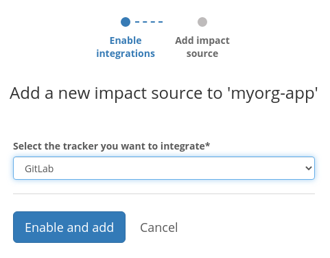
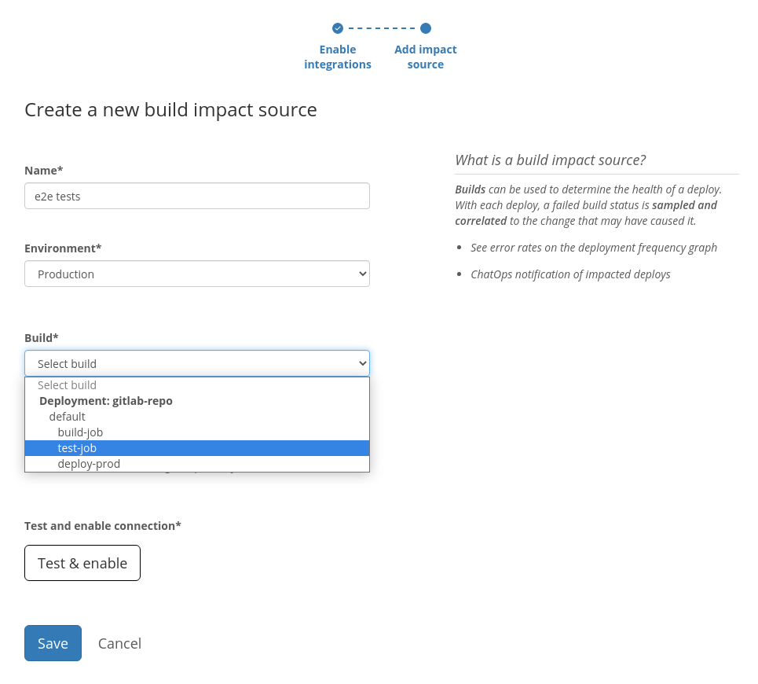

# GitLab CI/CD

## About the integration

GitLab CI/CD is the continuous integration tool provided by GitLab. It allows you to build, test, deploy, and monitor your application using automated jobs that are triggered manually or as a consequence of various interactions with your GitLab repository.

It is assumed you already have an active GitLab account and a repository with a working GitLab CI/CD configuration. \([Create a GitLab account](https://gitlab.com/users/sign_up) if you don't have one.\) 

## Setting up the integration

Refer to the [general instructions on adding GitLab as a code integration](../../code-deployment/gitlab.md#setting-up-the-integration).

You should also add at least one [Code deployment](../../../modeling-your-deployments/code-deployments/) based on a GitLab repository so that we may use it as a source of GitLab CI/CD builds.

## Configuring the integration

Once the integration is successful, find the **Impact sources** section in the sidebar and click the **+ Add** link nested under that section.

Select **GitLab** from the dropdown and continue by clicking **Enable and add**.

Give this build tracking instance a **name** and select which **build** or job inside a build should be used to base the impact measurements on.

That's it! Sleuth will now start verifying your deploys health by tracking whether the selected build/job is passing or failing. Head over to the Dashboard to start seeing your data in action in the project and deploy health graphs. 

## Removing the integration

Refer to the [general instructions on removing GitLab as a code integration](../../code-deployment/gitlab.md#removing-the-integration).

