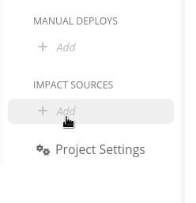

# Jenkins

## About the integration

Jenkins is an open-source automation server that enables developers to build, test, and deploy their software.

It is assumed you already have an active Jenkins instance up and running.

## Setting up the integration

Refer to the [general instructions on adding Jenkins integration](../../builds/jenkins.md).

## Configuring the integration

Once the integration is successful, find the **Impact sources** section in the sidebar and click the **+ Add** link nested under that section.

Select **Jenkins** from the dropdown and continue by clicking **Enable and add**.

Give this build tracking instance a **name** and select which **build** or job inside a build should be used to base the impact measurements on.

That's it! Sleuth will now start verifying your deploys health by tracking whether the selected build/job is passing or failing. Head over to the Dashboard to start seeing your data in action in the project and deploy health graphs.

## Removing the integration

Refer to the [general instructions on removing Jenkins integration](../../builds/jenkins.md).
