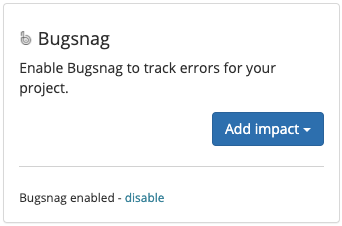

# Bugsnag

## About the integration

Bugsnag is a service that tracks your application errors. This integration allows Sleuth to track these errors to measure the impact your deploys make to the number of errors being generated.

It is assumed you already have an active Bugsnag account that is already tracking errors from your application. \([Create a Bugsnag account](https://docs.bugsnag.com/platforms/) if you don't have one.\) 

## Setting up the integration

To integrate Bugsnag as an error impact source in Sleuth: 

1. In the sidebar, click **Integrations**. 
2. Click the **Error Trackers** tab. 
3. In the Bugsnag tile, click **enable**. 
4. Enter your Bugsnag Personal Auth Token. This token can be found in your Bugsnag user profile, under _Personal auth tokens_. 

    5. Press **Save**. 

## Configuring the integration

Once the integration is successful, you will see an **Add impact** dropdown, along with the message **Bugsnag enabled** displayed in the tile. Select the Sleuth project you'd like to measure error impact on. 

Give this error tracking instance a **name** and select the **Bugsnag** **project** and **environment**.  
  

That's it! Sleuth will now start verifying your deploys health by tracking the error counts from Bugsnag. Head over to the Dashboard to start seeing your data in action in the project and deploy health graphs. 

## Removing the integration

#### If you wish to dissolve the Bugsnag integration for the organization: 

1. Click on **Integrations** in the left sidebar, then on **Error Trackers**. 
2. In the Bugsnag integration card, click **disable**. The message **Bugsnag disabled** is displayed in the Bugsnag integration card once the integration is dissolved.

The Bugsnag integration is disconnected and no longer available to any projects within that organization. Any project-level modifications you made to the Bugsnag integration will be lost.

