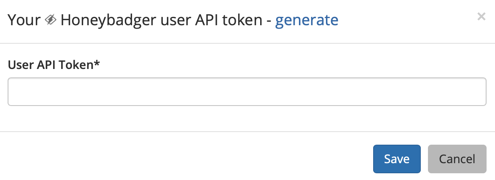
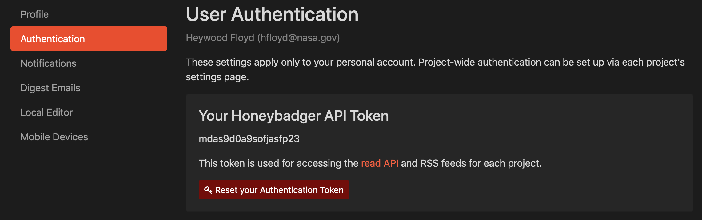
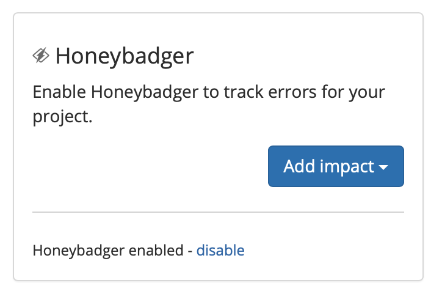
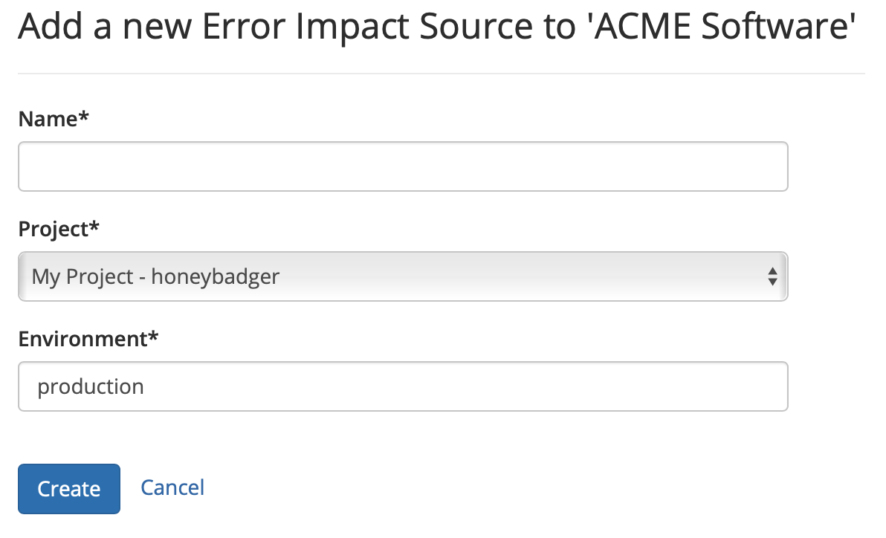

# Honeybadger

## About the integration

Honeybadger is a service that watches your applications in production and lets you know about errors and outages. This integration allows Sleuth to track these errors and outages to measure their overall impact to your code deploys, which is displayed in the [trend graph](../../../resources/terminology.md#dashboard) and, if applicable, in the [deploy card](../../../resources/terminology.md#deploy-cards) of every commit. 

It is assumed you already have an active Honeybadger account that is already tracking errors and outages on your application. \([Create a Honeybadger account](https://app.honeybadger.io/users/sign_up) if you don't have one.\) 

## Setting up the integration

To integrate Honeybadger as an error impact source in Sleuth: 

1. In the sidebar, click **Integrations**. 
2. Click the **Error Trackers** tab. 
3. In the Honeybadger tile, click **enable**. 
4. Enter your Honeybadger user API token. This token can be found in your Honeybadger user profile, under _Authentication_.       
5. Press **Save**. 

## Configuring the integration

Once the integration is successful, you will see an **Add impact** dropdown, along with the message **Honeybadger enabled** displayed in the tile. Select the Sleuth project you'd like to measure error impact on.   
  

Give this error tracking instance a **name** and select the **Honeybadger** **project** and **enviroment**. This information can be obtained in your Honeybadger account portal.  
  

That's it! Sleuth will now start including error information from Honeybadger in your deploys so you can start tracking the impact of your changes over time. Head over to the [Dashboard](../../../dashboard.md) to start seeing your data in action in the trend graph and deploy cards. 

## Removing the integration

#### If you wish to dissolve the Honeybadger integration for the organization: 

1. Click on **Integrations** in the left sidebar, then on **Error Trackers**. 
2. In the Honeybadger integration card, click **disable**. The message **Honeybadger disabled** is displayed in the Honeybadger integration card once the integration is dissolved.

The Honeybadger integration is disconnected and no longer available to any projects within that organization. Any project-level modifications you made to the Honeybadger integration will be lost.

