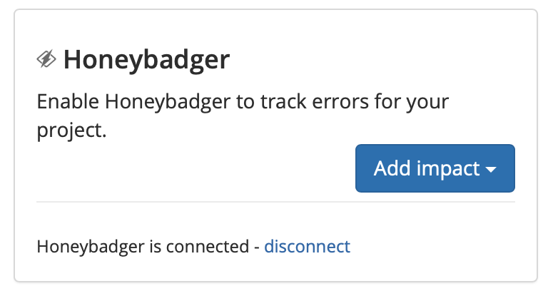

# Honeybadger

## About the Integration

Honeybadger is a service that watches your applications in production and lets you know about errors and outages. This integration allows Sleuth to track these errors and outages to measure their overall impact to your code deploys, which is displayed in the [trend graph](../../terminology.md#dashboard) and, if applicable, in the [deploy card](../../terminology.md#deploy-cards) of every commit. 

It is assumed you already have an active Honeybadger account that is already tracking errors and outages on your application. \([Create a Honeybadger account](https://app.honeybadger.io/users/sign_up) if you don't have one.\) 

### Making the integration

To integrate Honeybadger as an error impact source in Sleuth: 

1. In the sidebar, click **Integrations**. 
2. Click the **Error Trackers** tab. 
3. In the Honeybadger tile, click **connect**. 
4. Enter your Honeybadger user API token. This token can be found in your Honeybadger user profile, under _Authentication_.       
5. Press **Save**. 
6. Once the integration is successful, you will see an **Add impact** dropdown. Select the Sleuth project you'd like to measure error impact on.    
7. Give this error tracking instance a **name** and select the **Honeybadger** **project** and **enviroment**. This information can be obtained in your Honeybadger account portal.   

That's it! Sleuth will now start including error information from Honeybadger in your deploys so you can start tracking the impact of your changes over time. Head over to the [Dashboard](../../../dashboard.md) to start seeing your data in action in the trend graph and deploy cards. 

