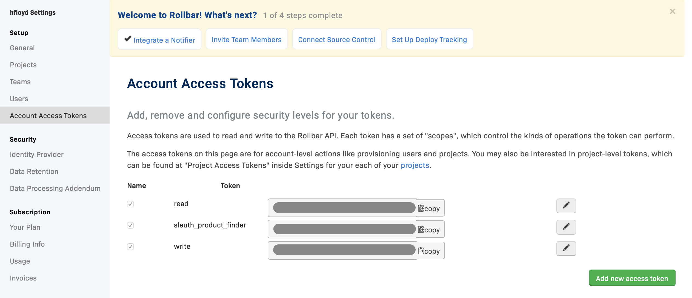

# Rollbar

## About the integration 

Rollbar is an error monitoring service that helps DevOps teams automate error monitoring and triaging. Before you start, you should already have a [Rollbar](https://rollbar.com/signup/) account and your environment setup and running. If not, head over to Rollbar to get things started. Once you're done, return to Sleuth so you can complete setup of the integration.

## Setting up the integration

To add the Sleuth Rollbar integration:

* Click **Integrations** in the sidebar.
* Click **enable** in the Rollbar Error Trackers card.
* Enter the Rollbar Auth Token, then press **Save**.


The Rollbar Auth Token can be found in Rollbar, under **Settings > {Project Name} > Members > Owners > Acount Access Tokens**, as shown below. **Do not use Project Access Tokens.** The Token must have at least `Read` and `Write` scopes enabled.\
\
[Get more information about Rollbar Account Access Tokens.](https://explorer.docs.rollbar.com/#section/Authentication/Account-Access-Tokens) 


## Configuring the integration

* Once the Rollbar integration is successful, you will see the message **Rollbar enabled** in the integration card.
* Click \*\*Add impact \*\*to select the Sleuth project that will be processing your application errors. All projects within the organization will be displayed in the dropdown.


Integrations are made at the Sleuth organization level, and are available for all projects within that organization. Individual settings for an integration are made at the project level.



Click **disconnect** to dissolve the Sleuth-Rollbar integration. You will need to re-authorize Sleuth again if you wish to re-establish the integration.


That's it! Sleuth will now start verifying your deploys health by tracking the error counts from Rollbar. Head over to the Dashboard to start seeing your data in action in the project and deploy health graphs.

## Removing the integration

#### To dissolve the Rollbar integration for the organization:

1. Click on **Integrations** in the left sidebar, then on **Error Trackers**.
2. In the Rollbar integration card, click **disable**. The message **Rollbar disabled** is displayed in the Rollbar integration card once the integration is dissolved.

The Rollbar integration is disconnected and no longer available to any projects within that organization. Other error trackers that may be connected to your organization are not affected.
