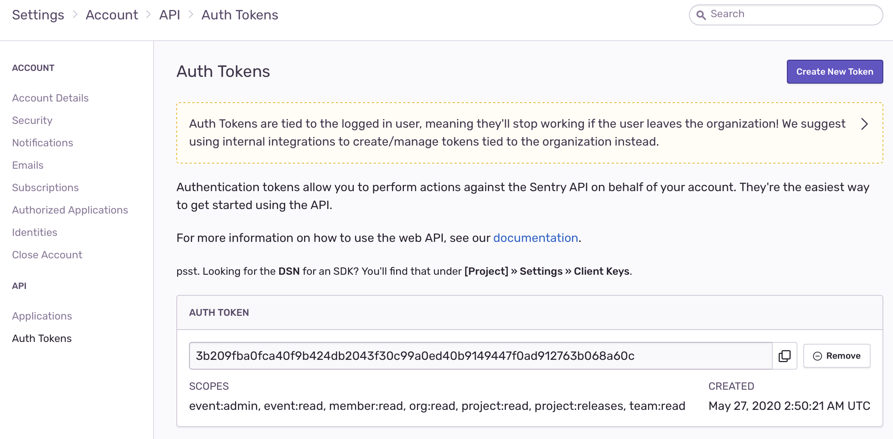
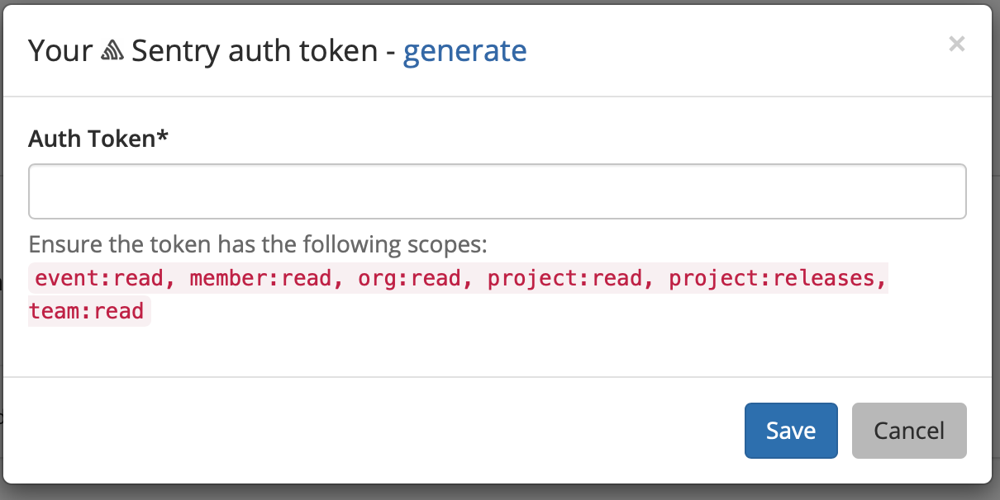
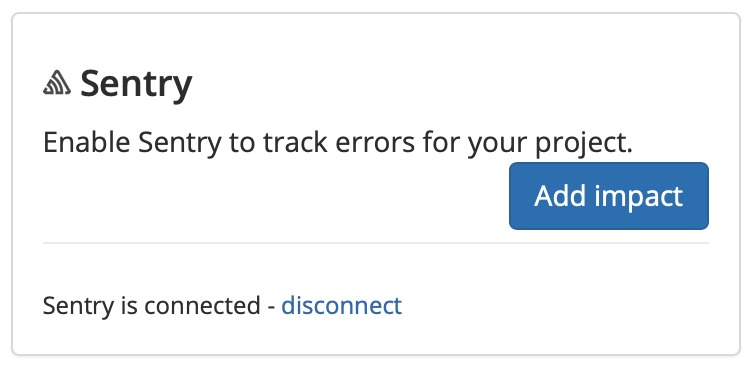
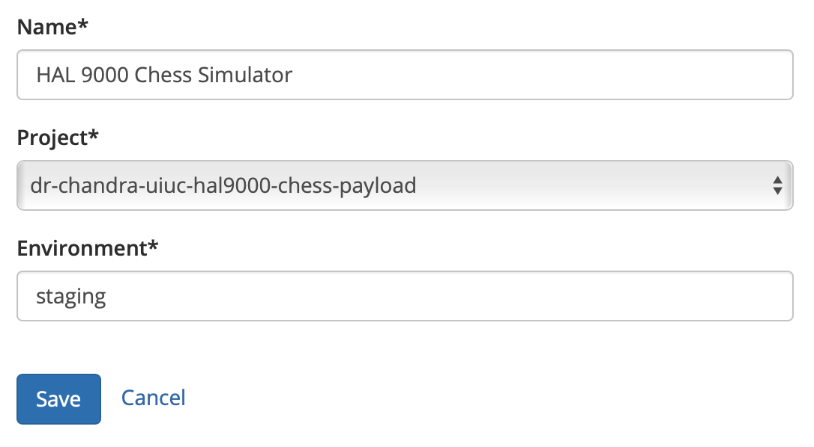

# Sentry

## About the integration  

Sentry is an error monitoring service that helps DevOps teams discover, triage, and prioritize their errors in real-time. Before you start, you should already have a Sentry account and your environment setup and running. If not, head over to [Sentry](https://sentry.io/signup/) to get things started. Once you're done, return to Sleuth so you can complete setup of the integration. 


Self-hosted Sentry instances are currently **not** supported by Sleuth. 


## Setting up the integration

To add the Sleuth Sentry integration:

* Click **Integrations** in the sidebar.
* Click the _Error Trackers_ tab, then **enable** in the Sentry card.
* Enter the Sentry Auth Token, then press **Save**. 


The Sentry Auth Token can be found in Sentry, under **Settings** &gt; **Account Details** &gt; **API** &gt; **Auth Token**, as shown below. 


 

* Once the Sentry integration is successful, you will see the message, **Sentry is connected** displayed. 

## Configuring the integration

* Click **Add impact** to select the Sleuth project that will be processing your application errors. All projects within the organization will be displayed in the dropdown. 


Sleuth will not auto-populate the **Environment** field dropdown due to the way the Sentry API handles environment data. Check your Sentry project first before populating this field. Environments are created when a deployed application monitored by Sentry sends environment data \(e.g., in Javascript, the application could send`environment: 'staging'`\) back to Sentry by tagging issues via your SDK.   
  
For more information,[ read more](https://docs.sentry.io/enriching-error-data/environments/?platform=browser#how-to-send-environment-data) about how Sentry receives environment data. 



Integrations are made at the Sleuth organization level, and are available for all projects within that organization. Individual settings for an integration are made at the project level.  


* The Sentry logo in the Change Source card turns to green when the integration is successful. 

That’s it—Sleuth will start displaying Sentry error metrics in your deploys. Read [**Dashboard**](../../../dashboard.md) for more information on how errors are communicated in deploy cards. 

## Removing the integration

#### If you wish to dissolve the **Sentry** integration for the organization: 

1. Click on **Integrations** in the left sidebar, then on **Error Trackers**. 
2. In the Slack integration card, click **disable**.

The Sentry integration is disconnected and no longer available to any projects within that organization. Any project-level modifications you made to the Sentry integration will be lost.

