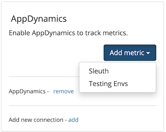

# AppDynamics

## About the integration

AppDynamics is a Business Observability Platform gives you a powerful view into the performance of your entire stack through the lens of your business. Before you start, you should already have a AppDynamics account and your environment setup and running. If not, head over to AppDynamics to get things started. Once you're done, return to Sleuth so you can complete setup of the integration.

## Setting up the integration

To add the Sleuth AppDynamics integration:

* Click **Integrations** in the sidebar.
* Click the _Metric Trackers_ tab, then **enable** in the AppDynamics card.
* Follow linked instructions on creating AppDynamics OAuth client
* Enter your AppDynamics tenant name, API Client name and secret in the corresponding fields.
* Press **Save**.
* Once the AppDynamics integration is enabled, you will see **AppDynamics enabled** displayed in the integration card (as shown below).

 (1).png>)

## Configuring the integration

* Click **Add metric** and select a Sleuth project that will collect the metrics AppDynamics generates. All projects within your organization will be displayed in the dropdown.


Integrations are made at the Sleuth organization level, and are available for all projects within that organization. Individual settings for an integration are made at the project level.


That's it! Sleuth will now start verifying your deploys health by tracking the values from your AppDynamics metric. Head over to the Dashboard to start seeing your data in action in the project and deploy health graphs.

## Removing the integration

#### To dissolve the AppDynamics integration for the organization:

1. Click on **Integrations** in the left sidebar, then on **Metric Trackers**.
2. In the AppDynamics integration card, click **disable**.

The AppDynamics integration is disconnected and no longer available to any projects within that organization. Any project-level modifications you made to the AppDynamics integration will be lost.

### Adding Impact

1. Click +Add under IMPACT SOURCES in left sidebar
2. Select AppDynamics from dropdown and click "Enable and add"
3.  Copy and paste the desired AppDynamics metric **REST URL** from AppDynamics controller UI

    Open _Applications_ dashboard \_\_and select **Metric Browser** from left hand navigation menu

 (1) (1).png>)

4\.    Select desired metric, right-click and press **Copy REST URL**

 (1).png>)
