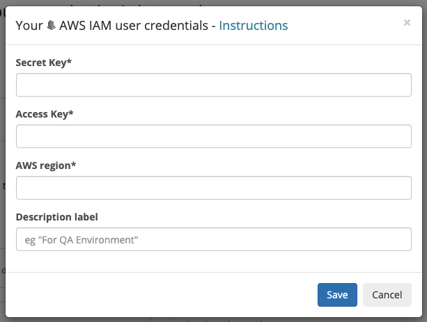

# AWS CloudWatch

## About the integration

AWS CloudWatch is a metric monitoring service that helps DevOps teams discover, triage, and prioritize their observability data in real-time. Before you start, you should already have a AWS account and your environment setup and running. If not, head over to AWS to get things started. Once you're done, return to Sleuth so you can complete setup of the integration. 

## Setting up the integration

To add the Sleuth CloudWatch integration:

* Click **Integrations** in the sidebar.
* Click the _Metric Trackers_ tab, then **enable** in the CloudWatch card.
* Enter your Secret Key, Access Key and your AWS region in the corresponding fields. 
* Press **Save**. 


The AWS Secret and Access key can be added to an AWS user. The user only requires the permissions: CloudWatch: List, Read and CloudWatch Logs: List, Read.

[https://docs.aws.amazon.com/IAM/latest/UserGuide/id\_users\_create.html](https://docs.aws.amazon.com/IAM/latest/UserGuide/id_users_create.html)


* Once the AWS CloudWatch integration is enabled, you will see **CloudWatch enabled** displayed in the integration card \(as shown below\). 

## Configuring the integration

* Click **Add metric** and select a Sleuth project that will collect the metrics CloudWatch generates. All projects within your organization will be displayed in the dropdown. 


Integrations are made at the Sleuth organization level, and are available for all projects within that organization. Individual settings for an integration are made at the project level.  


That's it! Sleuth will now start verifying your deploys health by tracking the values from your CloudWatch metric. Head over to the Dashboard to start seeing your data in action in the project and deploy health graphs.

## Removing the integration

#### To dissolve the AWS **CloudWatch** integration for the organization: 

1. Click on **Integrations** in the left sidebar, then on **Metric Trackers**. 
2. In the AWS CloudWatch integration card, click **disable**.

The AWS CloudWatch integration is disconnected and no longer available to any projects within that organization. Any project-level modifications you made to the AWS CloudWatch integration will be lost.

