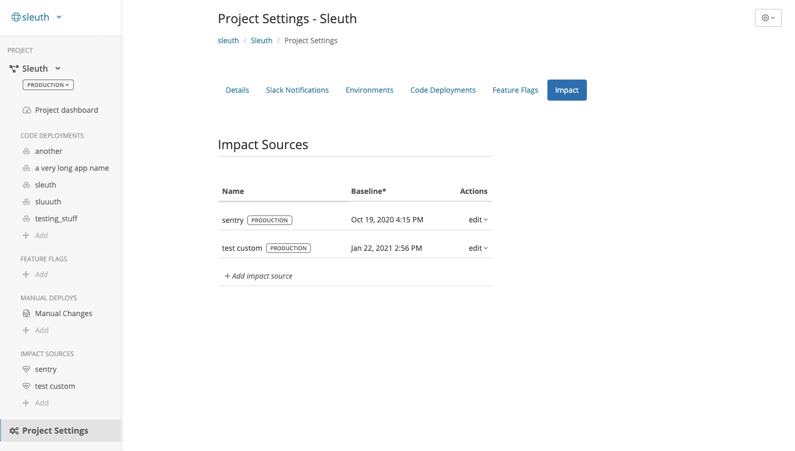
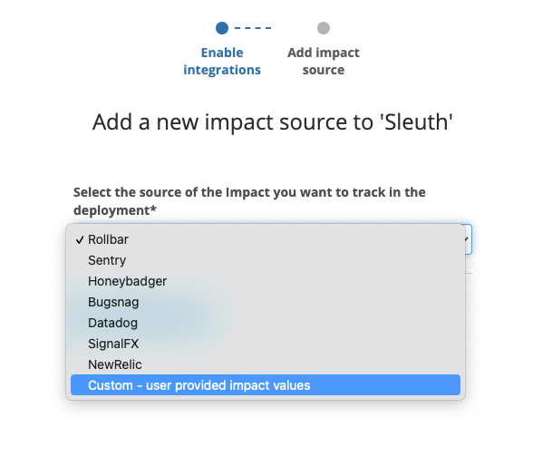

# Custom

## About the integration

Some teams track metrics that impact the health of their deploys outside of traditional Observability tools. Custom impact sources allow you to submit these values to Sleuth and still take advantage of the anomaly detection and deploy verification that Sleuth offers. Examples of some possible custom metrics are: number of user sign-ups, the pass/fail result of an environments smoke testing, etc. 

## Setting up the integration

Custom Impact is always available with your Sleuth project. No additional configuration is needed. See '[Configuring the integration](https://app.gitbook.com/@sleuth/s/sleuth/~/drafts/-MS-YGXPuGnJwPuVAHp1/integrations-1/impact-sources/metrics/custom#configuring-the-integration)' below for how to use a Custom Impact.

## Configuring the integration

* From your Project Settings --&gt; Impact - click **Add impact source** and select a Sleuth project that will collect the metrics Datadog generates. All projects within your organization will be displayed in the dropdown. 

* From the "Add a new impact source" screen choose - "Custom - user provided impact values"

* From the create screen, name your custom impact, choose a name that's descriptive, such as "number of signups"

* Once you've created the Impact Source you will be presented with instructions on how to report an Impact value to Sleuth. You will need to POST your data to a Sleuth REST endpoint that is specific to your metric. The dialog includes the exact URLs and information you will need to submit your data. For more details see the [API docs for submitting impact](https://help.sleuth.io/sleuth-api#custom-impact-registration).

That's it! Sleuth will now start verifying your deploys health by tracking the values from your custom metric. Head over to the Dashboard to start seeing your data in action in the project and deploy health graphs.

## Removing the integration

#### To remove the custom metric

1. Click on your **Project Settings --&gt; Impact**
2. Choose the metric you'd like to remove and choose delete from the cog.

