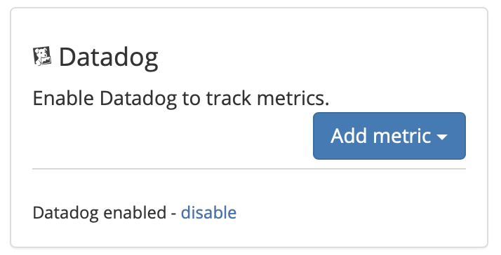
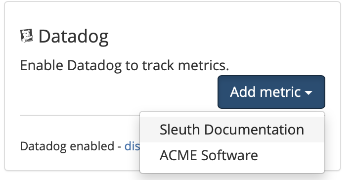

# Datadog

## About the integration

Datadog is an metric monitoring service that helps DevOps teams discover, triage, and prioritize their observability data in real-time. Before you start, you should already have a Datadog account and your environment setup and running. If not, head over to Datadog to get things started. Once you're done, return to Sleuth so you can complete setup of the integration. 

## Setting up the integration

To add the Sleuth Datadog integration:

* Click **Integrations** in the sidebar.
* Click the _Metric Trackers_ tab, then **enable** in the Datadog card.
* Enter your Datadog API Key and Application Key in the corresponding fields. 
* If your Datadog servers' are in the EU, enable the _My Datadog servers are in the EU_ checkbox. Leave this unchecked if you are unsure.  
* Press **Save**. 


The Datadog API Key and Application Key can be found under **Integrations **>** API**, as shown below. Or, you can click on the **generate** link, which will take you directly to the APIs page in your Datadog console, where you can then generate the keys Sleuth needs to complete the integration.  


 

* Once the Datadog integration is successful, you will see **Datadog enabled** displayed in the integration card (as shown below). 

## Configuring the integration

* Click **Add metric **and select a Sleuth project that will collect the metrics Datadog generates. All projects within your organization will be displayed in the dropdown. 


Integrations are made at the Sleuth organization level, and are available for all projects within that organization. Individual settings for an integration are made at the project level.  


That's it! Sleuth will now start verifying your deploys health by tracking the values from your Datadog metric. Head over to the Dashboard to start seeing your data in action in the project and deploy health graphs.

## Removing the integration

#### To dissolve the **Datadog** integration for the organization: 

1. Click on **Integrations** in the left sidebar, then on **Metric Trackers**. 
2. In the Datadog integration card, click **disable**.

The Datadog integration is disconnected and no longer available to any projects within that organization. Any project-level modifications you made to the Datadog integration will be lost.
