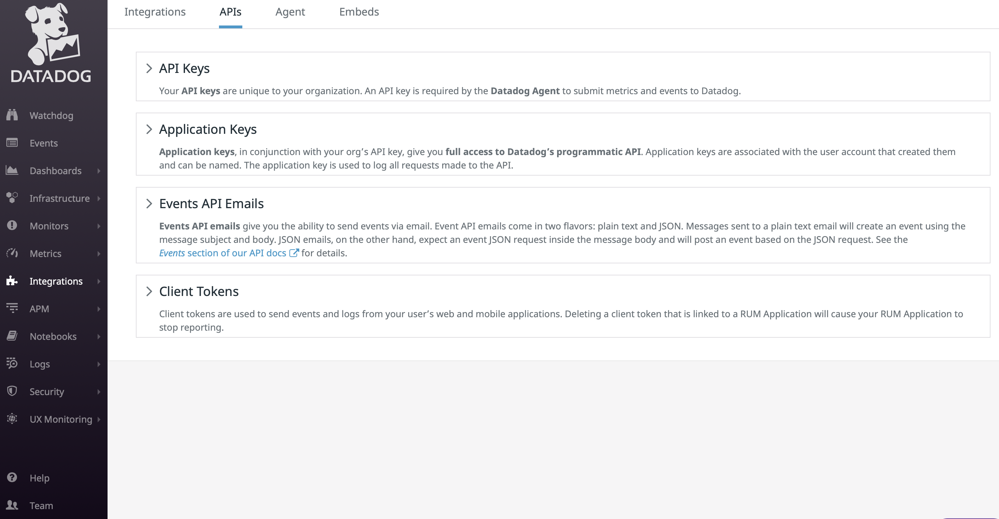
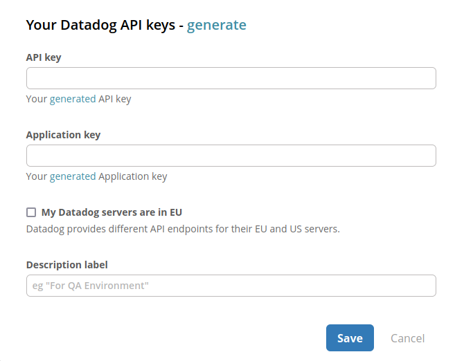
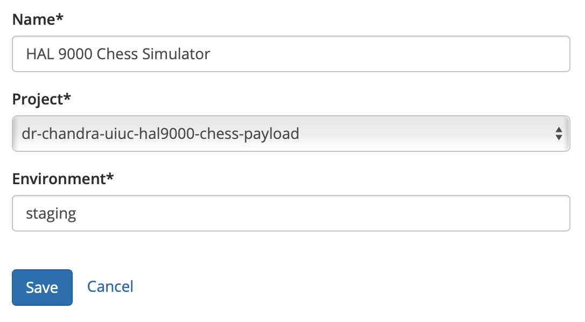

# Datadog

## About the integration

Datadog is an metric monitoring service that helps DevOps teams discover, triage, and prioritize their errors in real-time. Before you start, you should already have a Datadog account and your environment setup and running. If not, head over to Datadog to get things started. Once you're done, return to Sleuth so you can complete setup of the integration. 

## Setting up the integration

To add the Sleuth Datadog integration:

* Click **Integrations** in the sidebar.
* Click the _Metric Trackers_ tab, then **connect** in the Datadog card.
* Enter your Datadog API Key and Application Key in the corresponding fields. 
* If your Datadog servers' are in the EU, enable the _My Datadog servers are in the EU_ checkbox. If you don't know, leave this unchecked.  
* Press **Save**. 


The Datadog API Key and Application Key can be found under **Integrations** &gt; **API**, as shown below. Or, you can click on the **generate** link, which will take you directly to the APIs page in your Datadog console, where you can generate the keys Sleuth needs to integrate with Datadog.  


 

* Once the Datadog integration is successful, you will see the message, **Datadog is connected** displayed. 

## Configuring the integration

* Click **Add impact** to select the Sleuth project that will be processing your application metrics. All projects within the organization will be displayed in the dropdown. 


Integrations are made at the Sleuth organization level, and are available for all projects within that organization. Individual settings for an integration are made at the project level.  


* The Datadog logo in the Change Source card turns to green when the integration is successful. 

## Removing the integration


Click **disconnect** to dissolve the Sleuth Datadog integration. You will need to re-authorize Sleuth again if you wish to re-establish the integration.


* That’s it—Sleuth will start displaying Datadog metrics in your deploys. Read [**Dashboard**](../../../dashboard/) for more information on how metrics are communicated in deploy cards. 

## Notes

