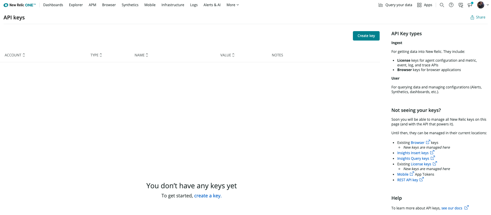
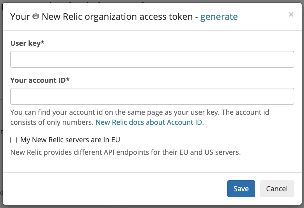
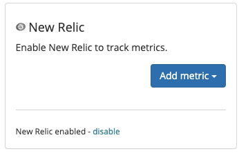
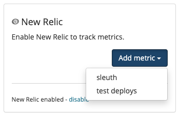

# NewRelic

## About the integration

New Relic One is an observability platform built to help engineers create more perfect software. From monoliths to serverless, you can instrument everything, then analyze, troubleshoot, and optimize your entire software stack. Before you start, you should already have a NewRelic account and your environment setup and running. If not, head over to NewRelic to get things started. Once you're done, return to Sleuth so you can complete setup of the integration. 

## Setting up the integration

To add the Sleuth NewRelic integration:

* Click **Integrations** in the sidebar.
* Click the _Metric Trackers_ tab, then **enable** in the NewRelic card.
* Enter your NewRelic User key and account ID in the corresponding fields. 
* If your NewRelic servers' are in the EU, enable the _My New Relic servers are in EU_ checkbox. Leave this unchecked if you are unsure.  
* Press **Save**. 


The NewRelic User key and account ID can be found under **Preferences **>** API Keys**, as shown below. Or, you can click on the **generate** link, which will take you directly to the API Keys page in your NewRelic console, where you can then generate the keys Sleuth needs to complete the integration.  


* Once the NewRelic integration is successful, you will see **NewRelic enabled** displayed in the integration card (as shown below). 

## Configuring the integration

* Click **Add metric **and select a Sleuth project that will collect the metrics NewRelic generates. All projects within your organization will be displayed in the dropdown. 


Integrations are made at the Sleuth organization level, and are available for all projects within that organization. Individual settings for an integration are made at the project level.  


That's it! Sleuth will now start verifying your deploys health by tracking the values from your NewRelic metric. Head over to the Dashboard to start seeing your data in action in the project and deploy health graphs.

## Removing the integration

#### To dissolve the **NewRelic** integration for the organization: 

1. Click on **Integrations** in the left sidebar, then on **Metric Trackers**. 
2. In the NewRelic integration card, click **disable**.

The NewRelic integration is disconnected and no longer available to any projects within that organization. Any project-level modifications you made to the NewRelic integration will be lost.
