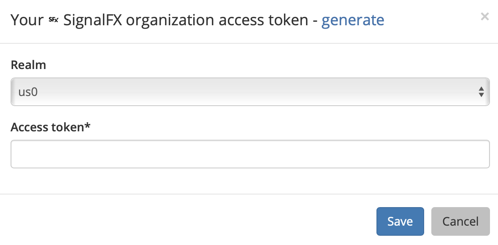
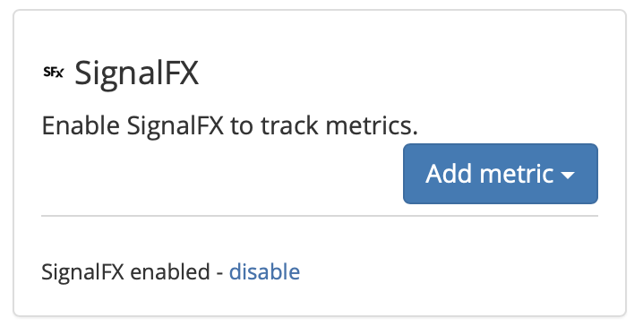
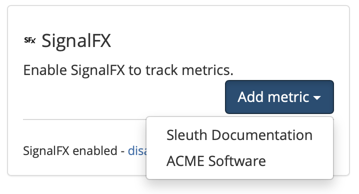

# SignalFx

## About the integration

SignalFx is an metric monitoring service that helps DevOps teams discover, triage, and prioritize their errors in real-time. With a Sleuth integration, your SignalFx metrics are gathered, analyzed and reported obn directly in the [Dashboard](../../../dashboard/). The [impact](../../../resources/terminology.md#impact) of your deploys are displayed instantly then iterated on over time, giving you not only instant feedback on the impact of your deploys, but also how your deploys affect your code over time. 

Before you start, you should already have a SignalFx account, and your environment setup and running. If not, head over to [SignalFx](https://app.us1.signalfx.com/#/dashboards) to get things started. Once you're done, return to Sleuth so you can complete setup of the integration. 

## Setting up the integration

To add the SignalFx integration:

* Click **Integrations** in the sidebar.
* Click the _Metric Trackers_ tab, then **enable** in the SignalFx card.
* Select your SignalFx _realm_ then enter your _Access token_. You can get your SignalFx access token by clicking the **generate** link, which will take you to your SignalFx dashboard.  


A **realm** is a self-contained deployment in which your SignalFx organization is hosted. To locate your realm, log in to your SignalFx account, click on your profile photo, click on _Organization Settings_, then _Members_, click on your profile name, then scroll down to the _Organizations_ section to find the realm where your account is hosted. 


* Press **Save**. 
* Once the SignalFx integration is successful, you will see **SignalFx enabled** displayed in the integration card \(as shown below\).   

## Configuring the integration

* Click **Add metric** to select the Sleuth project that will be processing your SignalFx data. All projects within the organization will be displayed in the dropdown \(as shown below\).   


Integrations are made at the Sleuth organization level, and are available for all projects within that organization. Individual settings for an integration are made at the project level.  


That’s it—Sleuth will start displaying SignalFx impact data in your deploys. Read [**Dashboard**](../../../dashboard/) for more information on how metrics are communicated within deploy cards. 

## Removing the integration

#### To dissolve the SignalFx integration for the organization: 

1. Click on **Integrations** in the left sidebar, then on **Metric Trackers**. 
2. In the SignalFx integration card, click **disable**. The message **SignalFx disabled** is displayed in the SignalFx integration card once the integration is dissolved.

The SignalFx integration is disconnected and no longer available. Any project-level modifications you made to the SignalFx integration will also be lost.

