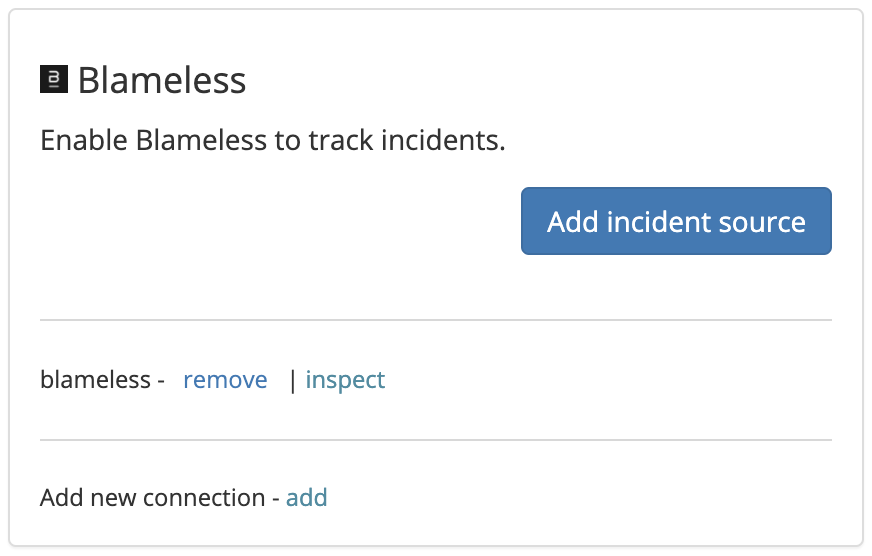

# Blameless

## About the integration

Blameless is an SRE software platform that helps organizations and engineers streamline their reliability efforts.&#x20;

## Setting up the integration

To add the Sleuth Blameless integration:

* Click **Integrations** in the sidebar.
* Click the _Incidents_ tab, then **add** in the _Blameless_ card.
* Enter your customer name (the name of the instance you were provided with)
* Client ID and Client secret (you can get information how to obtain on their[ website](https://docs.blameless.com/api/authentication#prerequisites))
* Press **Save**.

## Configuring the integration

* Click **Add incident source** and select a Sleuth project that will track Blameless incidents. All projects within your organization will be displayed in the dropdown.

* Configure impact source by selecting desired Blameless incident type and/or severity threshold to track with Sleuth.\
  Incidents with matching or lower severities will be considered a failure in Sleuth.
* Under advanced settings, you can control the historic data population. If checked Sleuth will populate all incidents that happened in the last 30 days and recalculate the project's Failure Rate and MTTR metrics.


Integrations are made at the Sleuth organization level and are available for all projects within that organization. Individual settings for integration are made at the project level.


* That's it! Sleuth will now start tracking incidents declared in Blameless.

