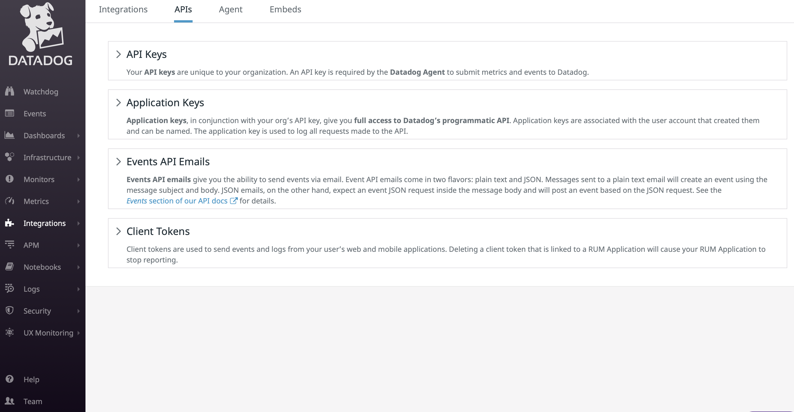
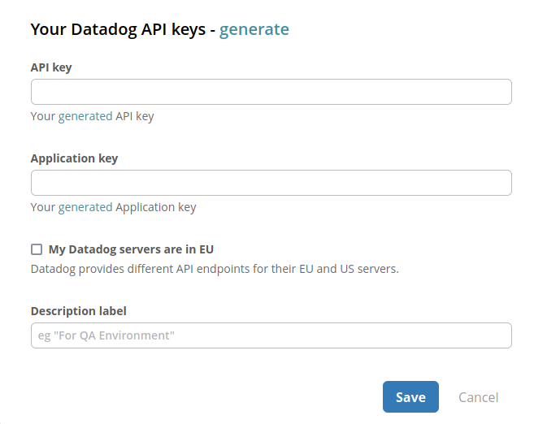
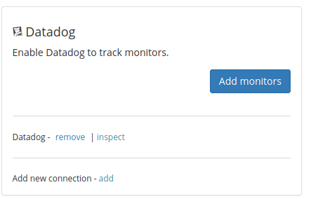

# Datadog

## About the integration

Datadog is a monitoring service that helps DevOps teams discover, triage, and prioritize their 
observability data in real-time. Before you start, you should already have a Datadog account and your environment 
setup and running. If not, head over to Datadog to get things started. Once you're done, return to Sleuth to 
complete the setup of the integration.

## Setting up the integration

To add the Sleuth Datadog integration:

* Click **Integrations** in the sidebar.
* Click the _Incidents_ tab, then **enable** in the Datadog card.
* Enter your Datadog API Key and Application Key in the corresponding fields. You need to create both of these separately. Generate API key [here](https://app.datadoghq.com/organization-settings/api-keys) and generate an Application key [here](https://app.datadoghq.com/organization-settings/application-keys).
* If your Datadog servers' are in the EU, enable the _My Datadog servers are in the EU_ checkbox. Leave this unchecked if you are unsure.
* Press **Save**.


The Datadog API Key and Application Key can be found under **Integrations > API**, as shown below. Or, you can click 
on the **generate** link on each field, which will take you directly to their page in Datadog where you can then generate the keys Sleuth needs to complete the integration.


* Once the Datadog integration is successful, you will see **Datadog enabled** displayed in the integration card (as shown below).

## Configuring the integration

* Click **Add monitors** and configure which Datadog monitors that Sleuth will track.
* Configure impact source by choosing the severity threshold of monitors to track with 
  Sleuth. \
  Incidents with matching or lower severities will be considered a failure in Sleuth. It is also recommended to 
  enter a monitor query to scope the monitors Sleuth tracks.


Integrations are made at the Sleuth organization level and are available for all projects within that organization. Individual settings for integration are made at the project level.


* That's it! Sleuth will now start tracking triggered monitors declared in Datadog.

