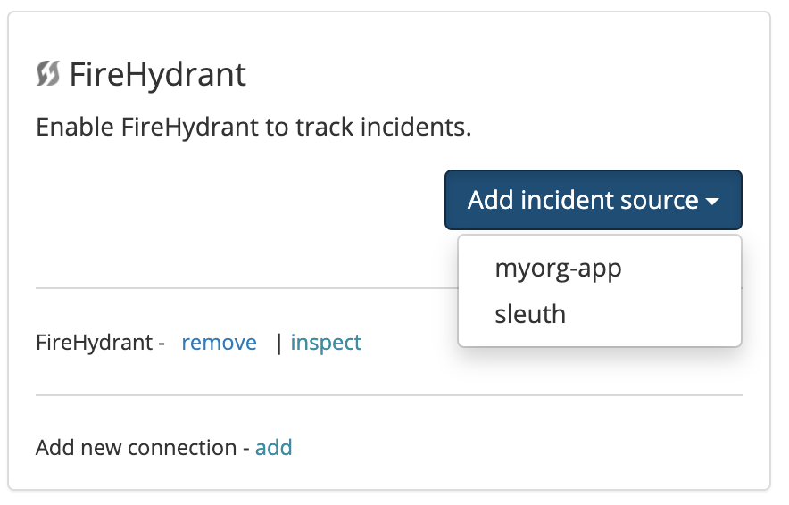

# FireHydrant

## About the integration 

FireHydrant takes care of alert handoff, automatiny incident declaration and management process. Integrating FireHydrant with Sleuth is simple using dedicated bot user.

## Setting up the integration

To add the Sleuth FireHydrant integration:

* Click **Integrations** in the sidebar.
* Click the _Incident Trackers_ tab, then **enable** in the FireHydrant card.
* Enter your Bot API token 
* Press **Save**. 

## Configuring the integration

* Click **Add incident source** and select a Sleuth project that will track FireHydrant incidents. All projects within your organization will be displayed in the dropdown.

* Configure impact source by mapping incidents FireHydrant's environment and service to Sleuth environment.


Integrations are made at the Sleuth organization level, and are available for all projects within that organization. Individual settings for an integration are made at the project level.  


* That's it! Sleuth will now start tracking incidents declared in FireHydrant.

