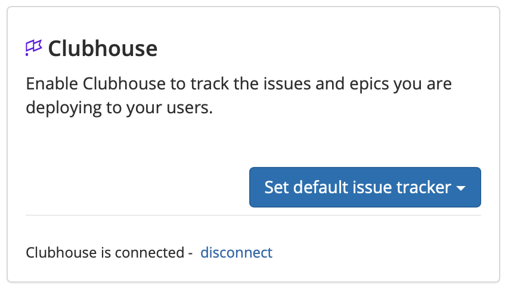
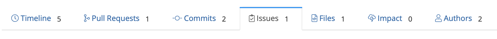
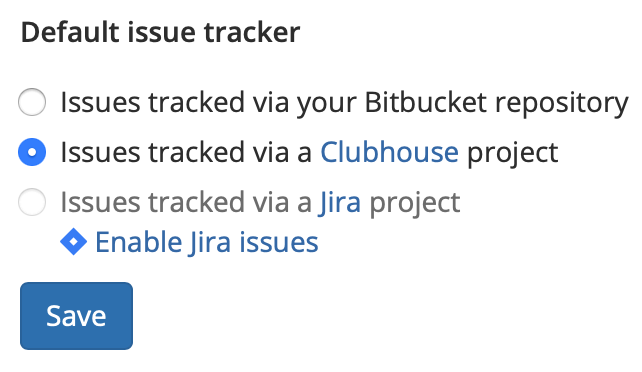

# Clubhouse

## About the integration  

The Clubhouse integration allows Sleuth to use Clubhouse as a deployment issue tracker. When you deploy, Sleuth will automatically connect your Clubhouse **stories** to the deploys, so you can always find the source of your changes later. 

Integration with Clubhouse is made at the Sleuth organization level. More than one [issue tracker](./) can be integrated with an organization. Although you can have multiple projects within an organization, each project can only configured to use a single issue tracker. 


Clubhouse uses the term **story** as its standard unit of work. For Sleuth Documentation purposes and throughout the Sleuth application interface, the term **issue** is used instead, and is synonymous with **story**. Clubhouse, similar to Jira, is an _issue_ tracker. 


## Setting up the integration

To set up the Sleuth Clubhouse integration:

1. Click **Integrations** in the left sidebar, then click **Issue Trackers**. 
2. In the _Clubhouse_ tile, click **enable**. 
3. Enter the _API Token_ of your Clubhouse instance into the corresponding field, then press **Save**. To quickly access your Clubhouse instance to obtain an API token, click **generate**.    
4. When integration is successful, **Clubhouse is connected** is displayed in the tile.   

## Configuring the integration

After setting up the Clubhouse integration, you must designate which Sleuth project to use as the default issue tracker. If you are configuring the integration immediately after setting it up, you can go directly to step \#2 below. 

#### To set the default issue tracker: 

1. Click on **Integrations** in the left sidebar, then on **Issue Trackers**. 
2. Click on the Clubhouse **Set default issue tracker** dropdown \(see screenshot above\).
3. All projects in the organization are displayed. Select which project you'd like to set Clubhouse as the default issue tracker for. 
4. Once the default project is chosen, you will be taken to the selected project's [dashboard](../../dashboard.md). 

With the integration complete, Sleuth will now connect your Clubhouse issues \(stories\) or projects when you enter the story or project ID prececed by **CH** \(e.g., CH14\) into your code deployment commit message. Connected stories will display in the Issues tab of a deployment card, which can be viewed by clickin the deploy's hash. 

You can also change the default issue tracker at any time. 

#### To change the default issue tracker: 

1. Click on **Project Settings** in the left sidebar, then select **Details**. 
2. Select a new default issue tracker. The integration **must be connected** at the organization level before it can be selected.   
3. Press **Save**.

#### To set a new default issue tracker: 

1. Click on **Project Settings** in the left sidebar, then select **Details**. 
2. Select a new default issue tracker. The integration must be connected via the organization before it's displayed here. 
3. Press **Save**.

## Removing the integration

#### If you wish to dissolve the Jira integration for the organization: 

1. Click on **Integrations** in the left sidebar, then on **Issue Trackers**. 
2. In the Clubhouse integration card, click **disable**. The message **Clubhouse disabled** is displayed in the Clubhouse integration card once the integration is dissolved.

The Clubhouse integration is disconnected and no longer available to any projects within that organization. You will need to select a new default issue tracker for any projects that used the Clubhouse integration. Simply follow the instructions in the section above: **To set a new default issue tracker**. 

