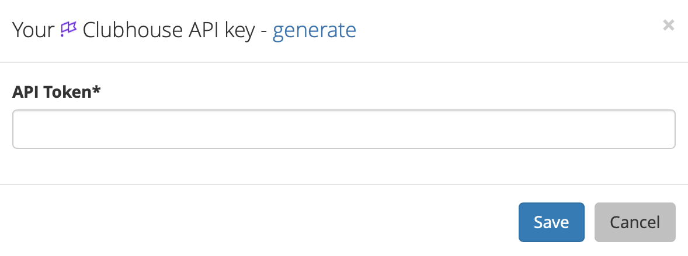

# Clubhouse

## About the integration  

The Clubhouse integration allows Sleuth to use Clubhouse as a deployment issue tracker. When you deploy, Sleuth will automatically connect your Clubhouse **stories** to the deploys, so you can always find the source of your changes later. 

Integration with Clubhouse is made at the Sleuth organization level. More than one [issue tracker](./) can be integrated with an organization. Although you can have multiple projects within an organization, each project can only configured to use a single issue tracker. 


Clubhouse uses the term **story** as its standard unit of work. For Sleuth Documentation purposes and throughout the Sleuth application interface, the term **issue** is used instead, and is synonymous with **story**. Clubhouse, similar to Jira, is an _issue_ tracker. 


## Setting up the integration

To set up the Sleuth Clubhouse integration:

1. Click **Integrations** in the left sidebar, then click **Issue Trackers**. 
2. In the _Clubhouse_ tile, click **connect**. 
3. Enter the _API Token_ of your Clubhouse instance into the corresponding field, then press **Save**. To quickly access your Clubhouse instance to obtain an API token, click **generate**.    
4. When integration is successful, **Clubhouse is connected** is displayed in the tile.   

## Configuring the integration

After setting up the Clubhouse integration, you must designate which Sleuth project to use as the default issue tracker. If you are configuring the integration immediately after setting it up, you can go directly to step \#2 below. 

#### To set the default issue tracker: 

1. Click on **Integrations** in the left sidebar, then on **Issue Trackers**. 
2. Click on the Clubhouse **Set default issue tracker** dropdown \(see screenshot above\).
3. All projects in the organization are displayed. Select which project you'd like to set Clubhouse as the default issue tracker for. 
4. Once the default project is chosen, you will be taken to the selected project's [dashboard](../../dashboard.md). 

#### To change the default issue tracker: 

1. Click on **Project Settings** in the left sidebar, then select **Details**. 
2. Select a new default issue tracker. The integration **must be connected** at the organization level before it can be selected.   
3. Press **Save**. 

## Removing the integration

