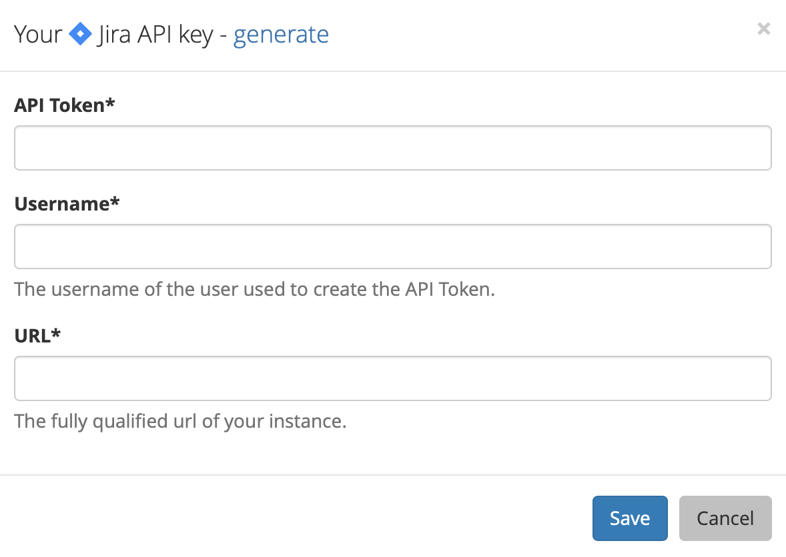

# Jira

## About the Integration  

The Jira integration allows Sleuth to use Jira as a deployment issue tracker. When you deploy, Sleuth will automatically connect your Jira issues to the deploys, so you can always find the source of your changes later. 

Integration with Jira is made at the Sleuth organization level. More than one [issue tracker](./) can be integrated with an organization. Although you can have multiple projects within an organization, each project can only configured to use a single issue tracker. Bitbucket, due to its own integration with Jira, can be used as one of those since Bitbucket can automatically connect to your Jira issues as long as both of those Atlassian products are both logged in with the same account. Bitbucket can also serve as a code deployment source change. 

Once Jira is configured as the issue tracker, every time the Jira issue key is included in a deploy's commit message, Sleuth will automatically link that deploy with the corresponding issue in Jira.

## Setting up the integration

To set up the Sleuth Jira integration:

1. Click **Integrations** in the left sidebar, then click **Issue Trackers**. 
2. In the _Jira_ tile, click **connect**. 
3. Enter the _API Token_, _Username_, and fully qualified _URL_ of your Jira instance into the corresponding fields, then press **Save**. To quickly access your Jira instance to obtain an API key, click **generate**.    
4. The Jira icon turns green and the message **Jira is connected** is displayed in the tile.

## Configuring the integration

After setting up the Jira integration, you must designate which Sleuth project to use as the default issue tracker. If you are configuring the integration immediately after setting it up, you can go directly to step \#2 below. 

#### To set the default issue tracker: 

1. Click on **Integrations** in the left sidebar, then on **Issue Trackers**. 
2. Click on the Jira **Set default issue tracker** dropdown \(see screenshot above\).
3. All projects in the organization are displayed. Select which project you'd like to set Jira as the default issue tracker for. 
4. Once the default project is chosen, you will be taken to the selected project's [dashboard](../../dashboard.md). 

#### To change the default issue tracker: 

1. Click on **Project Settings** in the left sidebar, then select **Details**. 
2. Select an issue tracker. The integration must be connected via the organization before it's displayed here. 
3. Press **Save**. 

## Removing the integration

#### If you wish to dissolve the Jira integration for the organization: 

1. Click on **Integrations** in the left sidebar, then on **Issue Trackers**. 
2. Click **disconnect**.

The Jira integration is disconnected and no longer available to any projects within that organization. Any projects that used the Jira integration will need a new default issue tracker selected. 

#### To set a new default issue tracker: 

1. Click on **Project Settings** in the left sidebar, then select **Details**. 
2. Select a new default issue tracker. The integration must be connected via the organization before it's displayed here. 
3. Press **Save**.

