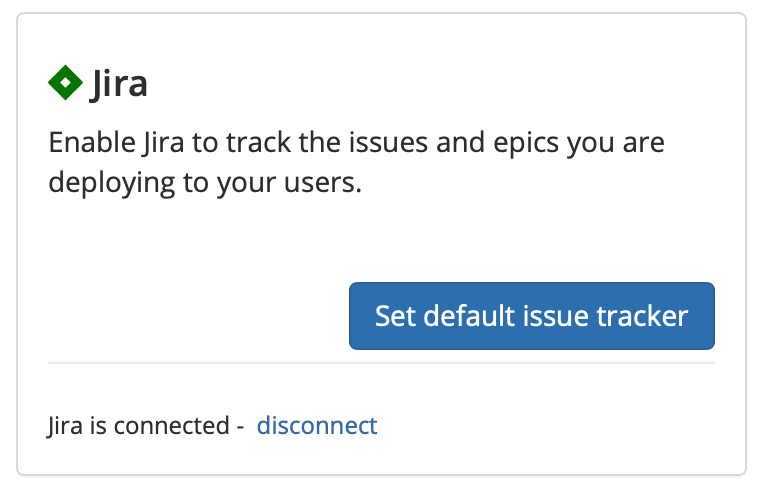

# Jira

## About the Integration  

The Jira integration allows Sleuth to use Jira as deployment issue tracker. When you deploy, Sleuth will automatically connect your Jira issues to the deploys, so you can always find the source of your changes later. 

Integration with Jira is made at the Sleuth organization level. More than one [issue tracker](./) can be integrated with an organization. Although you can have multiple projects within an organization, each project can only configured to use a single issue tracker. Bitbucket, due to its own integration with Jira, can be used as one of those since Bitbucket can automatically connect to your Jira issues as long as both of those Atlassian products are both logged in with the same account. Bitbucket can also serve as a code deployment source change. 

## Setting up the integration

To set up the Sleuth Jira integration:

1. Click **Integrations** in the left sidebar, then click **Issue Trackers**. 
2. In the _Jira_ tile, click **connect**. 
3. 

## Configuring the integration

## Removing the integration

