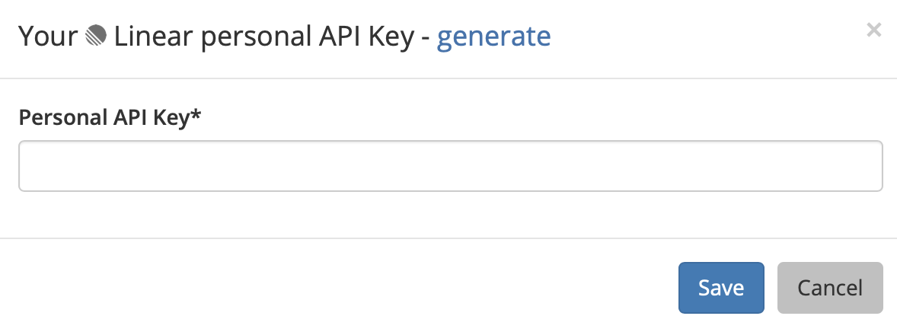
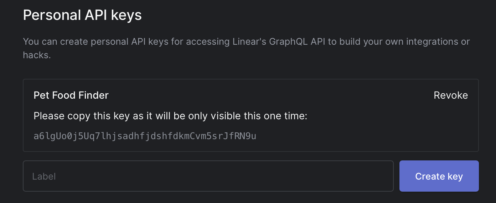
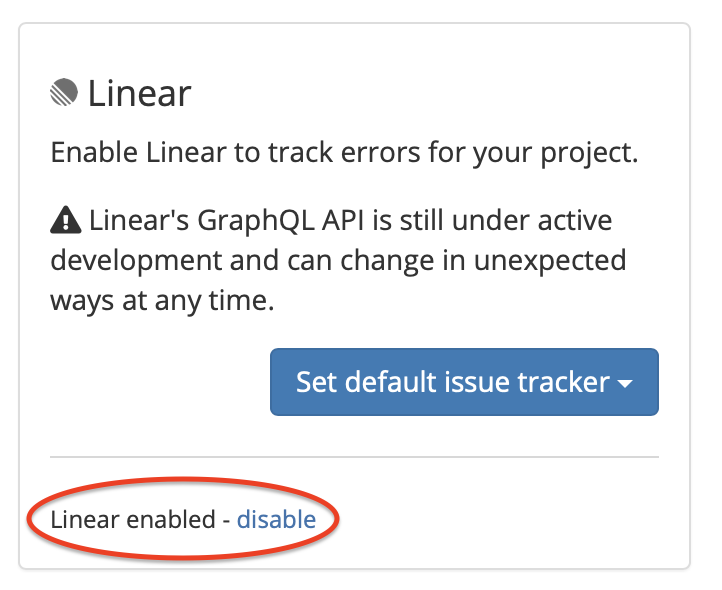

# Linear

## About the Integration 

The Linear integration allows Sleuth to use Linear as a deployment issue tracker. When you deploy, Sleuth will automatically connect your Linear issues to the deploys, so you can always find the source of your changes later. 

Integration with Linear is made at the Sleuth organization level. More than one [issue tracker](./) can be integrated with an organization. Although you can have multiple projects within an organization, each project can only be configured to use a single issue tracker.  

Once Linear is configured as an issue tracker, every time the Linear issue key is included in a deploy's commit message, Sleuth will automatically link that deploy with the corresponding issue in Linear.

## Setting up the integration

#### To set up the Sleuth Linear integration

1. Click **Integrations** in the left sidebar, then click **Issue Trackers**. 
2. In the _Linear_ tile, click **connect**. 
3. Enter the _Personal API Key_ of your Linear instance into the corresponding field, then press **Save**. To quickly access your Linear instance to obtain an API key, click **generate**. You will be taken to the **Personal API keys** section in your Linear dashboard.    =   
4. The message **Linear enabled** is displayed in the tile. Note the _Set default issue tracker_ dropdown; you will be setting the default issue tracker in the next section.   

## Configuring the integration

After setting up the Linear integration, you must designate which Sleuth project to use as the default issue tracker. If you are configuring the integration immediately after setting it up, you can go directly to step \#2 in **To set the default issue tracker** below. 

#### To set the default issue tracker

1. Click on **Integrations** in the left sidebar, then on **Issue Trackers**. 
2. Click on the Linear **Set default issue tracker** dropdown \(see screenshot above\).
3. All projects in the organization are displayed. Select which project you'd like to set Linear as the default issue tracker for. 
4. Once the default project is chosen, you will be taken to the selected project's [dashboard](../../dashboard/). 

#### To change the default issue tracker

1. Click on **Project Settings** in the left sidebar, then select **Details**. 
2. Select an issue tracker. The integration must be connected via the organization before it's displayed here. 
3. Press **Save**. 

## Removing the integration

#### If you wish to dissolve the Linear integration for the organization 

1. Click on **Integrations** in the left sidebar, then on **Issue Trackers**. 
2. In the Linear integration card, click **disconnect**.

The Linear integration is disconnected and no longer available to any projects within that organization. Any projects that used the Linear integration will need a new default issue tracker selected. 

#### To set a new default issue tracker

1. Click on **Project Settings** in the left sidebar, then select **Details**. 
2. Select a new default issue tracker. The integration must be connected via the organization before it's displayed here. 
3. Press **Save**.

The Linear integration is disconnected and no longer available to any projects within that organization. You will need to select a new default issue tracker for any projects that used the Linear integration. Simply follow the instructions in the section above: **To set a new default issue tracker**. 

