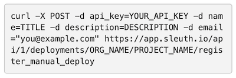

# Manual Changes

Manual changes let you enter anything that you want tracked in Sleuth. Such changes are those not tracked by source code, feature flags, or another type of change that Sleuth [currently supports](about-integrations....md). They are a free-form entry that can have any name or description you'd like. 

Examples include: 

* Manual scaling event
* Restart of a service
* Increase in capacity

To add a manual change: 

1. Click **Create** then **Add Manual Change** in the sidebar. 
2. Give the manual change a **Name** and **Description**. 
3. Press **Create**. 


A well-formed cURL request with your project data pre-populated is displayed \(see similar image below\). You can use this CURL request on CLI or by using Postman.  



Do not share this link with anyone outside of your organization. The CURL command that is displayed contains your private Sleuth API key and other private information. 


The manual change will display on your [Dashboard](../dashboard.md) and shown just like any other source of change. Manual changes are not tracked by Sleuth; you'll need to update and manage them on your own. 

To submit a manual change via CLI, read the Sleuth [API Reference](../resources/api-reference.md#manual-change). 

