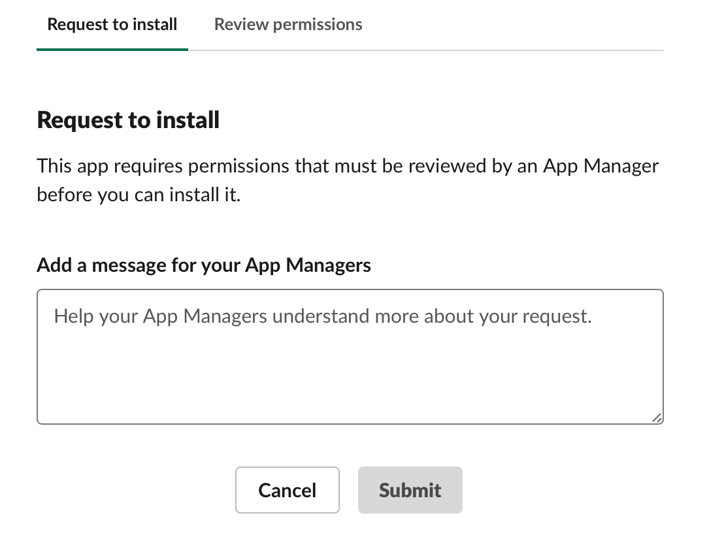

# Sleuth DORA App for Slack

The Sleuth DORA App for Slack provides you a [mission control for your deploys](../slack-mission-control/), right from Slack.

Before you start, you should already have a Slack account. Additionally, you should create channels that you plan to use for notifications in Slack before setting up the integration. Sleuth will ask for the Slack channel where it should send its notifications. You can create as many channels necessary to target notifications for individual environments.

The Sleuth DORA App for Slack is set up and configured in a Sleuth organization. When a channel is [configured with a Sleuth project](../settings/project/slack-notifications.md), anyone who follows that Slack channel will receive all messages sent to that channel. Sleuth can also be setup to send [personal Slack notifications](../slack-mission-control/personal-notifications.md).

## Setting up the integration

1. Click **Add** in the top navigation bar and select **Integration** from the list.
2. Select **Chat** from the drop-down located in the top right.
3. In the **Slack** tile, click **Enable**.
4. Click **Allow** to make the integration.


You must add Sleuth DORA as an Authorized Application in Slack. For more information, [read the Slack documentation](https://api.slack.com).



Adding a third-party integration to Slack must be authorized by your Slack App Manager. Slack allows you to message the App Manager directly from the _Request to install_ dialog, as shown below. Once authorization is granted, you can proceed with the integration.


4\. Upon a successful connection to your Sleuth account, the message **Slack  (Connected to workspace \_\<workspace name>**\_**)** is displayed in the tile.

<figure><figcaption></figcaption></figure>


The Slack integration is done at the organization level. Since multiple [projects](../modeling-your-deployments/projects/) can exist within an organization, you'll want to go in to each [project and configure notifications](../settings/project/slack-notifications.md) individually.


## Configuring the integration

To setup team notifications for a project see


[slack-notifications.md](../settings/project/slack-notifications.md)


To setup personal notifications for yourself see


[notifications.md](../settings/account/notifications.md)


## Removing the integration

#### If you wish to dissolve the Sleuth DORA App for **Slack** for the organization:

1. Click on **Integrations** in the left sidebar, then on **Chat Ops**.
2. In the Slack integration card, click **disable**. The message **Slack disabled** is displayed in the Slack integration card once the integration is dissolved.

The Slack DORA App for Slack is disconnected and no longer available to any projects within that organization. Any project-level modifications you made to the Sleuth DORA App for Slack will be lost.
