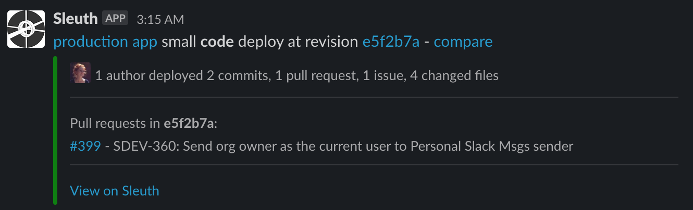

# Slack

### About the Integration  

Take DevOps clarity to the next level with the Sleuth-Slack integration. Keep your teams and other principals informed throughout the entire CI/CD lifecycle by using Slack as your main communication channel. Gone are the days of bloated distribution lists and constantly pestering your team with yet another "We've deployed again!" email. Use Slack's powerful communications features to keep development teams informed about your code deploys, and your entire organization up to date on your team's progress. 

Agile teams will spend most of their time viewing the Sleuth Dashboard to get the granular detail they need to keep deploys on track. Other members of your organization, however, just want a quick update on your team's progress without being inundated with the details; the Big Picture view, if you will. 

A Slack message from Sleuth provides just that—a single, automated message where they can see: 

* when your deploy occurred; 
* what was deployed; 
* how big the deploy was; 
* the commit hash; 
* how many commits, PRs, issues, and changes were in the deploy; 
* any [Jira](jira.md) issues associated with the deploy; and
* any additional information within Sleuth.  


A [Jira integration](jira.md) is required to view associated Jira issues within automated Slack messages from Sleuth.  


Before you start, you should already have a Slack account. Additionally, you should create channels that you plan to use for messaging in Slack before setting up the integration in Sleuth. Sleuth will ask for the Slack channel where it should send its messages to. 


You can select either a Private or Public Slack channel. Select a Public channel, then share that channel with your teams from within Slack for maximum DevOps' team visibility. 


To add the Slack integration:

* Click **Integrations** in the sidebar.
* Click **connect** in the Slack Chat Ops card. 


You must add Sleuth as an Authorized Application in Slack.  
For more information, [read the Slack documentation](https://api.slack.com).


* The Slack logo in the Change Source card will turn green when the integration is successful. 


Click **disconnect** to dissolve the Sleuth-Slack integration. You will need to re-authorize Sleuth again if you wish to re-establish the integration.


* That’s it—Sleuth will now use Slack to relay important deploy information to your team. Remember, you can share your Slack channel with anyone in your organization who needs visibility into what your team is doing.

  
  ****

