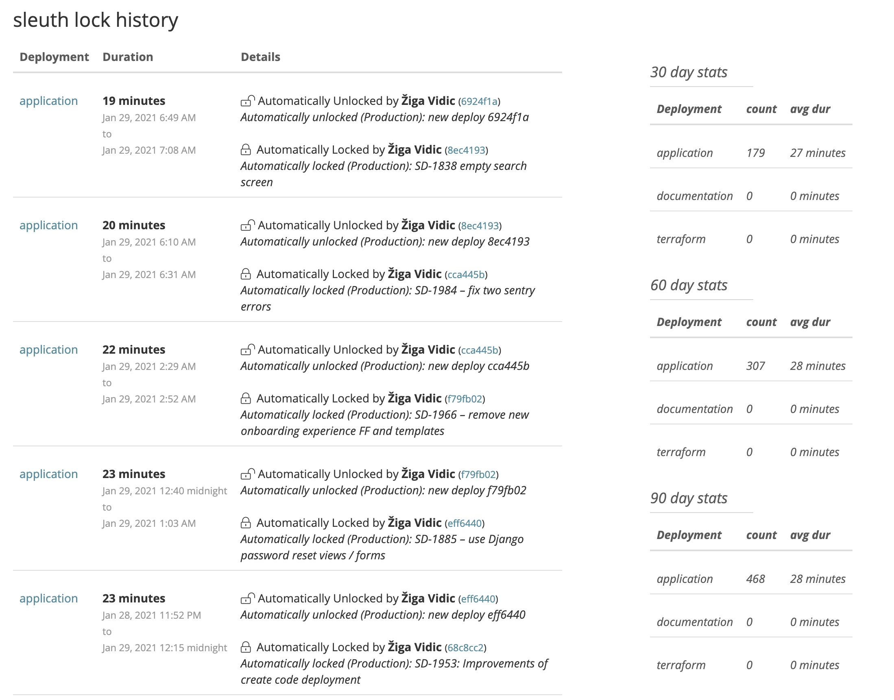

# Deployment locking

The Lock feature in Sleuth prevents pull requests from merging into deployment branches, and generates automatic notifications via your [Slack](../../integrations-1/slack.md) channel.

#### Manual locking

You can manually lock a deployment or all deployments within a project with one click of a button from your dashboards. You can view your lock history so you can learn how frequently your team locks their deploys and why.

#### Automatic locking

You can also configure Sleuth to auto-lock deployments [when PRs are merged for the deployment branch](https://help.sleuth.io/settings/project/code-deployments#automatically-lock-deployments).

Read Sleuth CTO [Don Brown's blog post](https://www.sleuth.io/post/prevent-unwanted-changes-with-sleuth-deployment-locking) on how Sleuth's locking feature can make your DevOps life easier!

##
