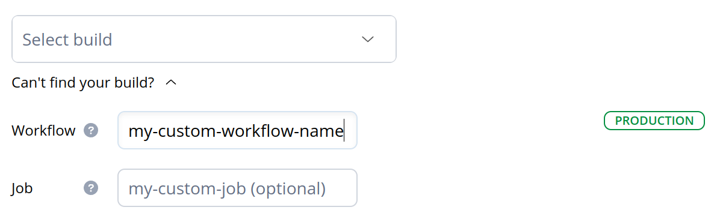

# How to register a deploy

## Notifying Sleuth when you deploy

How does Sleuth know when you have deployed? There are five different ways Sleuth can be notified:

* [Precise (CI/CD) – automatically detect deploys from completed CI/CD builds](how-to-register-a-deploy.md#precise-deploy-detection-from-completed-ci-cd-builds)
* [Precise (webhook) – send Sleuth a webhook so we know exactly when you've deployed](how-to-register-a-deploy.md#precise-deploy-registration-via-a-webhook)
* [Approximate – automatically create deploys for every PR merged](how-to-register-a-deploy.md#approximate-automatic-tracking-for-each-pr-merged)
* [Approximate – automatically create deploys for every commit created](how-to-register-a-deploy.md#approximate-automatic-tracking-for-each-push-to-the-configured-branch)
* [Approximate – automatically create deploys for every tag created](how-to-register-a-deploy.md#approximate-automatic-tracking-for-each-tag-made-against-the-configured-branch)


We highly **recommend precise deploy registration**. Knowing exactly when you've made your deploy unlocks the truly powerful features of Sleuth such as Impact tracking, notifications and more.


### Precise deploy detection from completed CI/CD builds

When this option is selected Sleuth will guide you through a CI/CD mapping step where you'll map a build / job / pipeline name to each Sleuth environment. Sleuth will then automatically register a deploy on a successfully completed build / job / pipeline that matches the mapped name.

When using CI/CD build deploy detection there is no need to modify your build scripts or change the way you deploy, Sleuth does all the work and will track your deploys precisely and automatically.

For example, we use CircleCI where we have many jobs, but only two are relevant for deploy registration. These are `deploy-prod` and `deploy-stage`, so our mapping between CI/CD and Sleuth environments looks like so:



Sleuth is only able to do auto deploy detection from CI/CD builds for our supported [CI/CD integrations](../../integrations-1/builds/). If you don't see your CI/CD provider please reach out and let us know. We're always adding new Integrations and are prioritizing as demand dictates.

Keep in mind that even without a supported provider you can still achieve precise tracking using our [webhook registration](how-to-register-a-deploy.md#precise-deploy-registration-via-a-webhook).


#### Manually entering build and job names


This feature is currently only supported when using GitHub Actions.


Certain complex configurations such as using [reusable workflows](https://docs.github.com/en/actions/using-workflows/reusing-workflows) can produce dynamically named workflows and jobs. Sleuth might not be able to get their names from the provider API, which means they won't be available for selection.

To get around this limitation we provide an alternative UI that lets you manually enter workflow and job names. It is accessed by clicking _Can't find your build?_ under the build selection dropdown.

<div align="center">

<figure><figcaption></figcaption></figure>

</div>

#### Tracking deploys from nested workflows

Some workflows are configured in a **nested structure**; top-level jobs are used to **trigger additional (sub-)jobs**, and any completed sub-job should be considered a deploy by Sleuth.


```yaml
Workflow name: My Test Workflow

Jobs:
    Example Job 1
        Example Sub-Job 1
        Example Sub-Job 2
```


CI/CD tools **concatenate the job and sub-job names**, placing a `/` between them and return them as a **single string**.

To account for such a setup in build mappings, a job "prefix" can be manually specified in the `Job` field, followed by `/*`:


```yaml
Job: Example Job 1/*
```


#### Only detect builds that match the environment branch

When a code deployment has been configured to [map separate branches to environments](creating-a-deployment.md#mapping-the-branch-you-deploy-from), Sleuth's default behavior is to register each specified build against its mapped environment whenever the specified build name is detected, regardless of which branch that build might have been generated from in the CD pipeline. This is the preferred behavior for about 90% of Sleuth customers.&#x20;

Some customers' CD workflows, however, require that Sleuth register a specified build against its mapped environment only when that build has been generated from the specific branch associated with the mapped environment.&#x20;

For such cases, Sleuth provides a toggle under Advanced Settings that, when enabled, tells Sleuth to register the specified build only when that build's source branch matches the mapped environment branch. &#x20;

<figure><figcaption></figcaption></figure>

Note that when using any of Sleuth's native CI/CD integrations, this toggle will also impact which builds are included in the Builds tab on the Deploy Details screen. The toggle will not, however, limit which builds appear on Deploy Details screen for deploys that are registered using our [webhook registration](how-to-register-a-deploy.md#precise-deploy-registration-via-a-webhook).&#x20;

#### Build mapping caveats

There are several edge cases where using CI/CD mapping won't be an option:

* The GitHub Actions workflow uses the matrix feature
* The code repository is in Bitbucket and the CI/CD system is on Azure
* The branch mapped to the target environment in Sleuth is a prefixed branch
* When using Jenkins, only a limited set of jobs is available for mapping. To be applicable, a job must be configured to use [GitSCM](https://plugins.jenkins.io/git/#plugin-content-pipelines).

When build mapping is not an option, the fallback is to register deploys with a webhook.

### Precise deploy registration via a webhook

Ping Sleuth with a Git commit SHA or a tag to tell Sleuth you've deployed by making a `POST` request. You'll need to provide theses values when making the call:

* `YOUR_API_KEY`
* `YOUR_SHA`
* `ORG_NAME`
* `PROJECT_NAME`

You can find your _API Key_ in **Organization Settings** > **Details** > **Api key**:


You can find `YOUR_SHA` using the commands:

```http
git checkout YOUR_BRANCH
git rev-parse HEAD
```


[Get more detailed information](https://help.sleuth.io/sleuth-api#deploy-registration) on precisely registering a deploy via the Sleuth API.


### Approximate – automatic tracking for each PR merged

When this option is selected Sleuth will treat every merged PR on your branch as a deploy.


Sleuth allows you to specify a delay in minutes. When this is set Sleuth will only create the deploy after the delay has passed. A delay of 0 will create the deploy immediately.


### Approximate – automatic tracking for each push to the configured branch

When this option is selected Sleuth will treat every commit made to your branch as a deploy.


Sleuth allows you to specify a delay in minutes. When this is set Sleuth will only create the deploy after the delay has passed. A delay of 0 will create the deploy immediately.



It's rarely the case that every commit is a deploy. Only true continuous deployment setups deploy every commit.


### Approximate – automatic tracking for each tag made against the configured branch

When this option is selected Sleuth will treat every tag made on your branch as a deploy.


Sleuth allows you to specify a delay, in minutes. When this is set Sleuth will only create the deploy after the delay has elapsed. A delay of 0 will create the deploy immediately.



If you've chosen this option make sure that your CD system is tagging your code only once it's actually been deployed.

