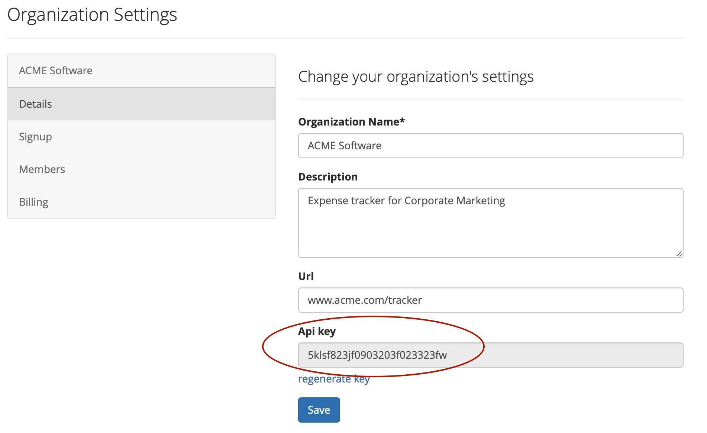

# How to register a deploy

## Notifying Sleuth when you deploy

How does Sleuth know when you have deployed? There are three different ways Sleuth can be notified:

* Precise - send Sleuth a webhook so we know exactly when you've deployed
* Approximate - automatically create deploys for every commit created
* Approximate - automatically create deploys for every tag created


We highly **recommend precise deploy registration**. Knowing exactly when you've made your deploy unlocks the truly powerful features of Sleuth such as Impact tracking, notifications and more.


### Precise deploy registration via a webhook

Ping Sleuth with a Git commit SHA or a tag tell Sleuth you've deployed by making a `POST` request. You'll need to provide theses values when making the call:

* `YOUR_API_KEY`
* `YOUR_SHA`
* `ORG_NAME`
* `PROJECT_NAME` 

You can find your _API Key_ in **Organization Settings** &gt; **Details** &gt; **Api key**:



You can find `YOUR_SHA` using the commands:

```http
git checkout YOUR_BRANCH
git rev-parse HEAD
```


[Get more detailed information](https://help.sleuth.io/sleuth-api#deploy-registration) on precisely registering a deploy via the Sleuth API.


### Approximate - automatic tracking for each push to the configured branch

When this option is selected Sleuth will add a POST-commit hook to your repository.

This will ping Sleuth every time a commit is made. When we detect a commit against your projects branc, Sleuth will register a new deploy.

### Approximate - automatic tracking for each tag made against the configured branch

When this option is selected, Sleuth will add a POST-commit hook to your repository.

This will ping Sleuth every time a commit is made. When we detect a tag against your projects branch, Sleuth will register a new deploy.

