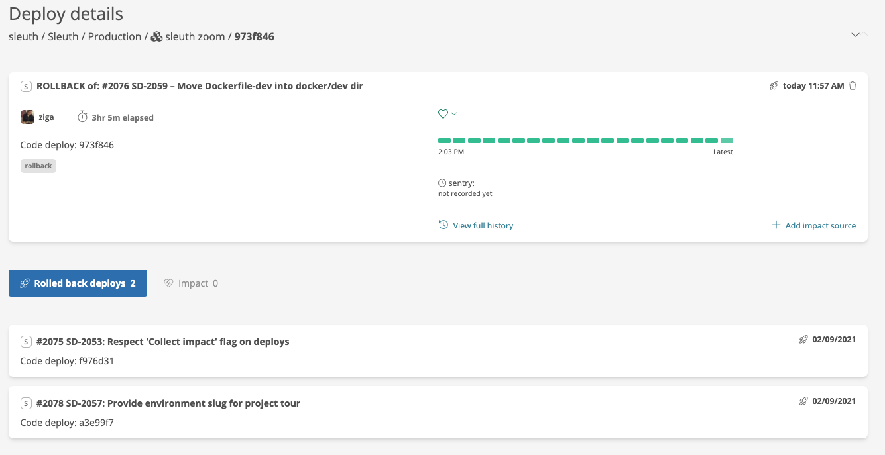
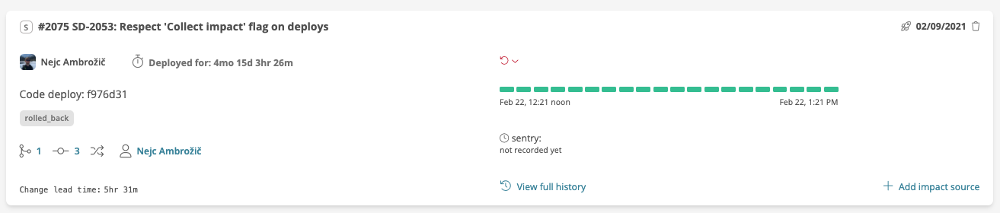

# Rollbacks

Sleuth supports the deployment of a previously deployed code revision, otherwise know as a rollback.

It's not too uncommon for a team to deploy a code change and then realize, after some time, that the change isn't behaving how they intended. The most common strategy to deal with this is to roll-forward, making a quick fix for the new error. However, sometimes it's too difficult to make a quick fix and you decide to revert to the last knows good code revision.

Sleuth automatically detects rollbacks. Sleuth looks at the revision being deployed and, if it finds that revision in a previous deploy, will do the following:

* Register the deploy as a rollback, linking to the deploys that were rolled back in the process
* Tag the rollback deploy with the tag `rollback`
* Change the status of the deploys that were rolled back to "Rolled back"
* Add the tag `rolled_back` to the rolled back deploys

Rollbacks, by default, are counted as a failure when determining your [Change failure rate](../../accelerate-metrics/change-failure-rate.md). 

