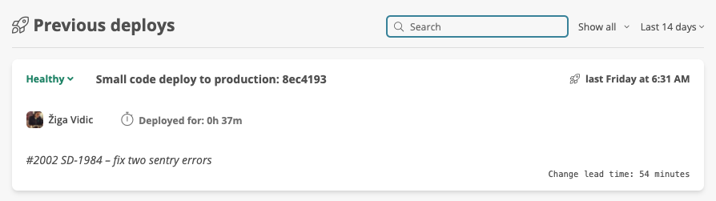
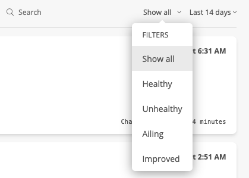
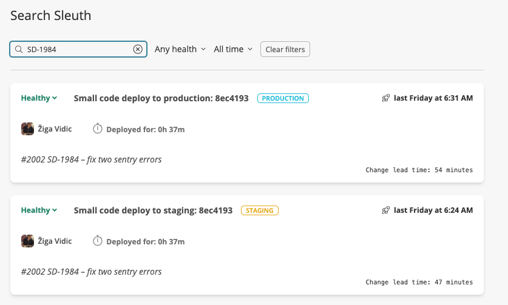
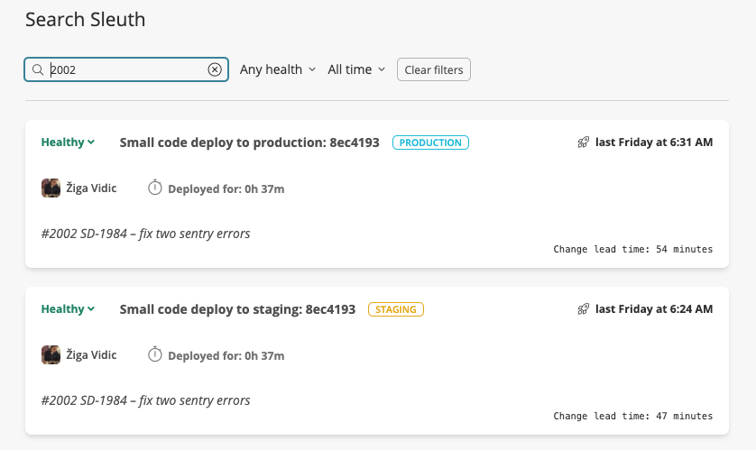
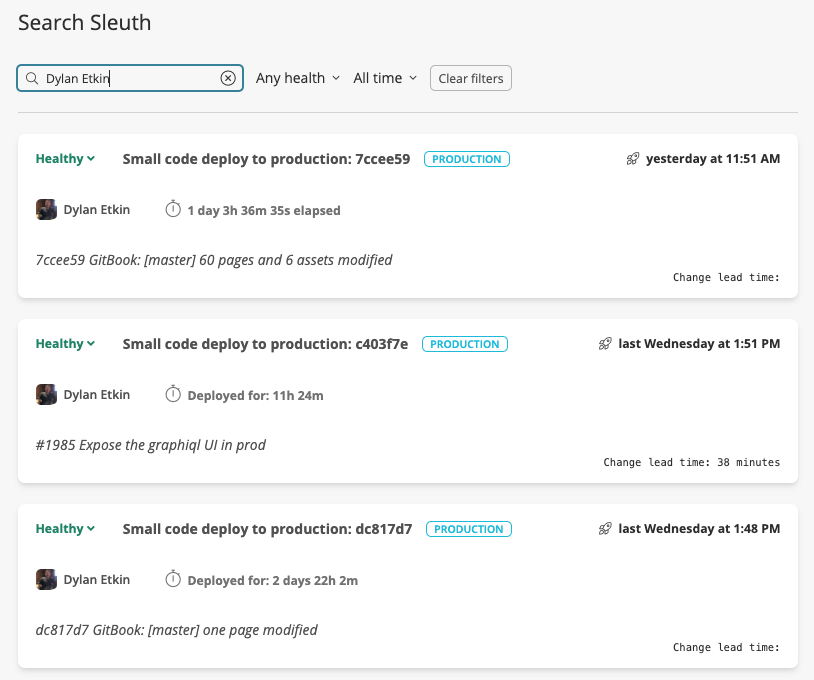

# Search

Search your entire deployment history using Sleuth's built-in search function. The search field features  search-as-you-type functionality; simply start typing and the previous [deploys](../deploy-cards.md) that contain the entered search terms are displayed. 



You can also filter the deploy cards based on the health of the deploy. For example, you might only want to search deploys that were deemed _Unhealthy_. The dropdown value can be set either before or after you begin searching. 



#### Sleuth searches through all content contained in a deploy:

* Pull request key, summary and descriptions
* Commit hashes and descriptions
* Issue keys, summaries and descriptions
* File names
* Authors username and full name
* Sleuth [tags](tags.md)

#### Use Sleuth search to quickly discover when an issue was deployed:



#### Search to find if a pull request was deployed:



#### Search to find all the deploys made by one of your developers:



### Searching with Slack

If your organization has a Slack integration, you can search directly from the Slack app. You can search from any channel in the integrated organization. 

To search using Slack, type `/sleuth` then your search term. For example:

```text
/sleuth memory leak 
```

Search results are displayed in the same channel. The most recent 5 changes are returned. You can click the View all button to view all search results in Sleuth.


By default `/sleuth MY SEARCH TEXT` will search all projects in the organization with the Slack integration for matching deploys.

