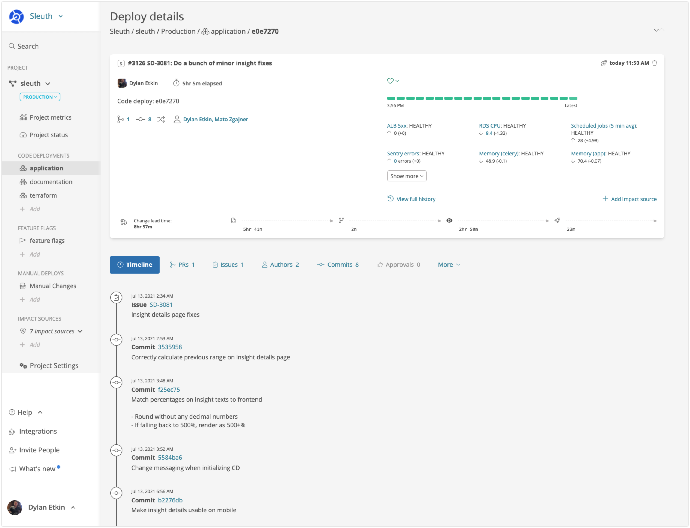

# Deploys

Deploys are how Sleuth represents the changes that are made from your [code deployments](code-deployments/), [feature flag](feature-flags.md) and [manual changes](manual-changes.md). Deploys are specific to a [project](projects/), [environment](environment-support.md) and change source. Deploys aggregate information from the integrations you've connected in Sleuth, these include:

* All [code information](../integrations-1/code-deployment/) in a deploy with quick links to external systems to view; pull requests, commits, files and authors
* Any [issues referenced](../integrations-1/issue-trackers/) in commits, pull requests or branch names
* Any [CI/CD builds associated](../integrations-1/builds/) with the deployed revision
* The who (authors), what (change details) and when (timeline) of the deploy
* How long the deploy was live in your Environment
* The change lead time for the deploy, the time from first commit to deploy
* The size of the deploy, based on number of commits, pull requests, etc
* A timeline of all the deploy events
* The Impact attributed to the change and the Sleuth, auto-determined, health of the deploy

## Deploy card timeline icons

Sleuth uses a variety of timeline icons in the deploy view to quickly and easily communicate the evolution of your deploy. You can hover over the icons to get more detailed information. The icons used are shown below:

| Icon                                          | Description      | Meaning                                                                                                                                                                |
| --------------------------------------------- | ---------------- | ---------------------------------------------------------------------------------------------------------------------------------------------------------------------- |
|        | **Commit**       | A commit was made in your deploy. Commits link, hash, messages, date and time, are also displayed.                                                                     |
|  | **Pull Request** | A pull request was made in your deploy. The pull request link, description, id, date and time, are also displayed.                                                     |
|         | **Issue**        | Issues referenced via configured issue tracker integrations are displayed. The issue link, key and description are displayed, along with issue creation date and time. |
|         | **Build**        | Builds for the deploy revision via configured build services are displayed. The build link, name, hash and results are displayed, along with build run date and time.  |
|       | **Deployed**     | Your code has been deployed.                                                                                                                                           |
|          | **Soon**         | Indicates that a deploy is coming soon.                                                                                                                                |
|      | **Replaced**     | Indicates that the current deploy has been superseded by another deploy.                                                                                               |
|         | **Too Many**     | Shown when there are too many event icons to display. Hovering over this icon will let you know how many icons are currently hidden.                                   |

## Deleting deploys

If, for some reason, you need to delete a deploy you can do so by clicking the trash can icon in the upper-right corner of a deploy. This action only deletes the deploy from Sleuth; your connected systems are not affected.
