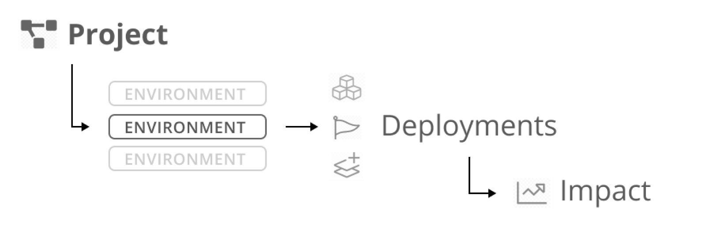

# Environments

Sleuth's environment support lets you model your change sources, such as code deployments, feature flags, and impact, across the multiple deployment environments you maintain. Environments are defined at the project level and all code deployments and feature flags within a project share Environments.

Once setup, Sleuth provides you with a clear view of how your deploys move through your different environments. Sleuth highlights and allows you to drill into the drift that forms between your Environments. 

Sleuth is flexible and allows you to map your Environments to your code in the way that you already work. Whether you deploy one branch to multiple environments or you maintain a code branch per environment Sleuth works for you.

 (1).png>)
