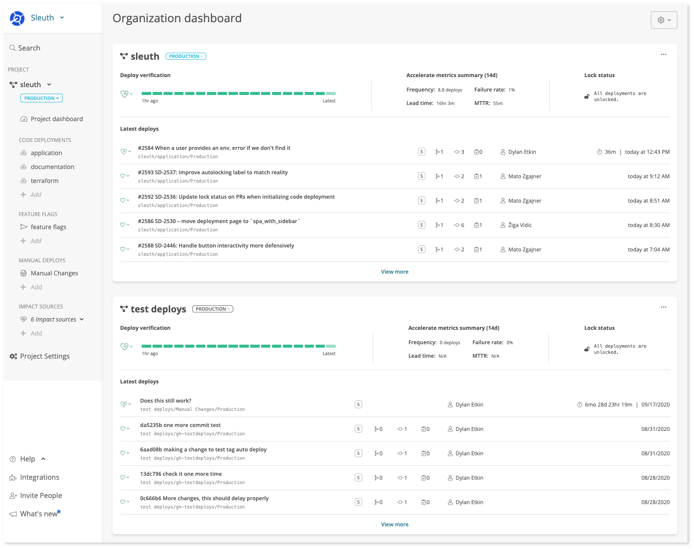

# Organization

An **Organization** is the top level container that Sleuth uses to organize your [Project's](projects/). Most of your team will spend their time in the project and deployment level dashboards.

However, for managers or executives looking for the 50-foot view of multiple projects Sleuth offers an Organization dashboard.

With your organization dashboard you can:

* Compare and contrast your project's Accelerate metrics
* See the overall [health](../auto-verify-your-deploys/) of your organizations deploys 
* Get a snapshot view into exactly what's been changing across your [projects](projects/)

Your organization dashboard can be accessed vial the options in the top right Organization switcher by choosing the "Organization dashboard" link from the menu.

