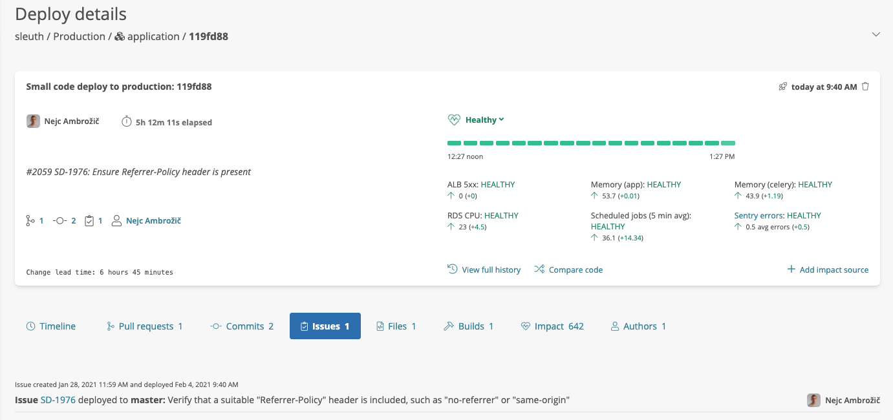

# Issue trackers

Once you've [connected your issue tracker](../../integrations-1/issue-trackers/), Sleuth will automatically display issues referenced in:&#x20;

* Pull request titles and descriptions
* Commit descriptions
* Git branch names

There are several places in Sleuth where you can view these related issues. At the lowest level, each deploy includes an Issues tab that lists any issues associated with that deploy along with direct links to those issue source records in your issue tracker.

Sleuth also provides higher-level "Issue breakdowns" on the Project Metrics, Team Metrics, and Work in Progress dashboards, providing visibility into the status and type of any issues referenced across any of the PR/Deploys you have in focus on those dashboards. For Project Metrics and Team Metrics, this means you can see breakdowns for issues you've shipped, while Work-in-Progress displays breakdowns for issues that you're _about_ to ship!

From any of these dashboards, the Issue breakdown chart also provides a clickable drill-through to a detailed listing of issues with links to their source records in your issue tracker.

<figure><figcaption>
Drill-through to detailed issue listing from "Issue breakdowns" chart 
</figcaption></figure>

Issue Type is particularly useful for understanding the nature of the work that's going into each release (new features, bugs, tech debt...), while Issue Status is useful for identifying potential breaks in your issue management workflow (e.g. an issue on the Work in Progress dashboard shows as 'Done' even though it has an outstanding PR).&#x20;

See the p[roject settings details](../../settings/project/details.md) documentation on how to configure your issue tracker for your project.
