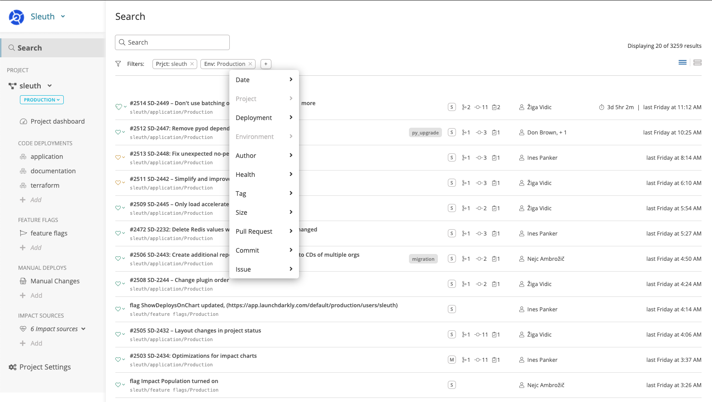
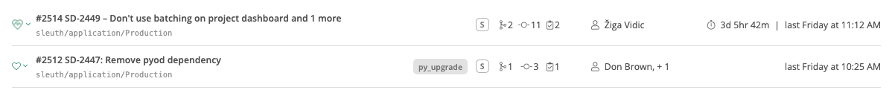
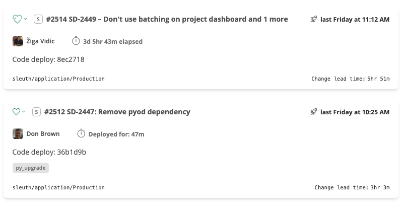
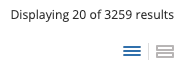

# Search

No good sleuth should be without an amazing magnifying glass. Sleuth's search is now the most powerful tool in your kit, allowing you to instantly find the cause of any bad deploys.

Search in Sleuth allows you to search across all of your [Projects](projects/), [Deployments](code-deployments/) and [Environments](environment-support.md). Use Sleuth search to:

* Quickly discover the root cause of a bug or incident: filter by date and environment to quickly bisect and see where the bad change was introduced
* See when a pull request, commit or issue was deployed to your various environments: filter by pull request id, issue key or commit hash or description 
* See which environments are missing a change: filter by the change description and see which environments it's been deployed in
* See what kind of changes are causing your service to be unhealthy: filter by all unhealthy deploys
* Find all the migrations you've made: filter by the migration tag
* Find all the changes made by a specific team member: filter by the author of the change
* Find all the deploys that might have been just a little too large: filter by the size of the deploy
* And much more, slice and dice your deploys, your way

## Sleuth search filters

| Filter | Description |
| :--- | :--- |
| Date | Limits your search between a date range |
| Project | Limits your search to a specific set of projects |
| Deployment | Limits your search to a specific set of deployments |
| Environment | Limits your search to a specific set of environments |
| Author | Limits your search to users that have participated in a Deploys commits, issue, pull request or was the instigator of the deploy |
| Health | Filters your search by deploys that match the set of health's selected |
| Tag | Filters your search by any tags that exist on the deploys. See [tags](code-deployments/tags.md) for the list of tags Sleuth adds automatically  |
| Size | Filters your search by deploys of the specified sizes |
| Pull Request | Searches for any deploys that contained the specified pull request ids |
| Commit | Searches for any deploys that contained the specified commit SHAs |
| Issue | Searches for any deploys that contained the specified issue keys  |
| Free text | Sleuth allows you to search for deploys by searching for any text that was included in the commit, pull request and issue descriptions that were included in the deploy |

## Sleuth search display

Sleuth supports two views for search results; the default list view and a card view that contains more information. 

The views can be toggled via the control in the upper right hand corner of the Search page. Your preferred view preference will be saved.

