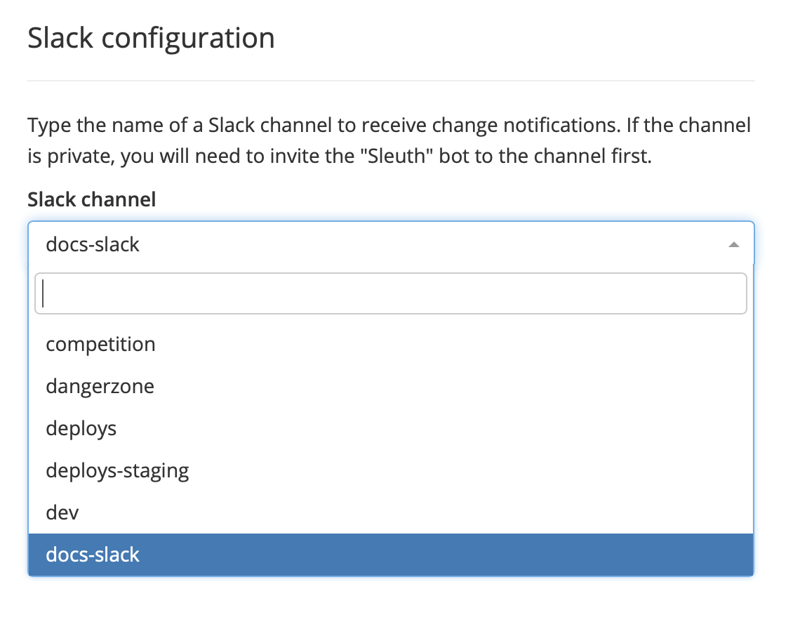
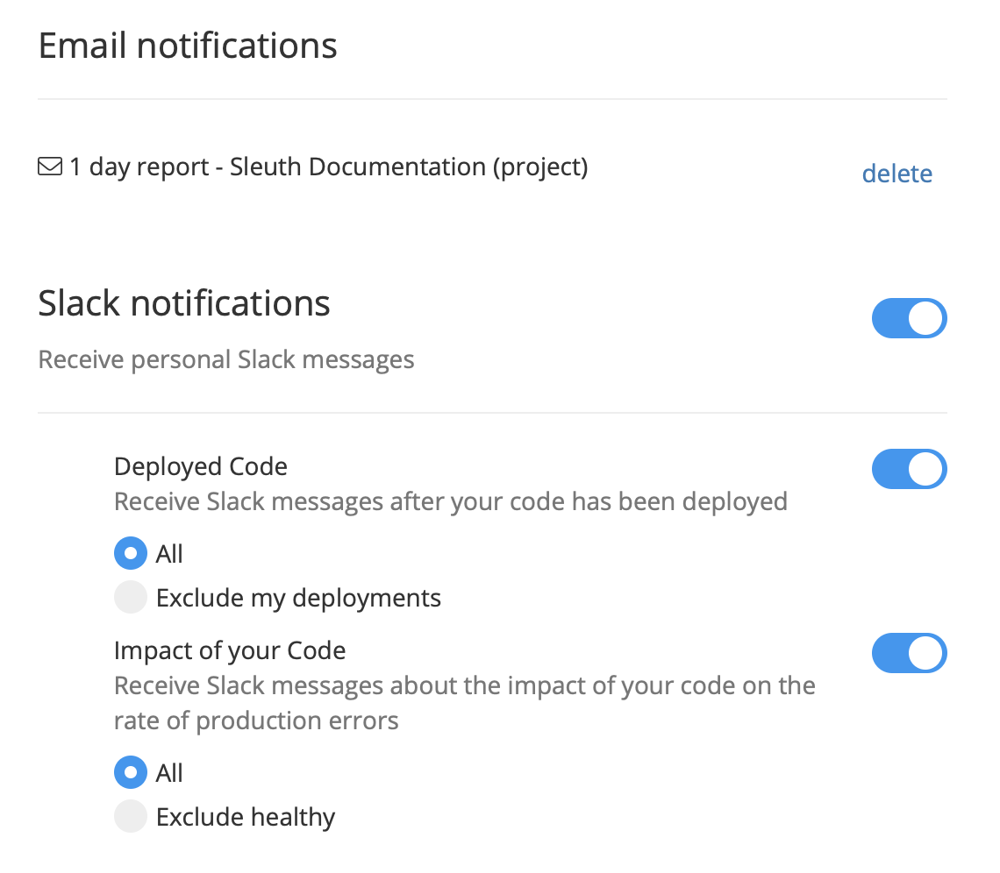

# Slack & Email Notifications

Sleuth can send emails or Slack notifications when something of significance happens, including messages for your entire team, yourself, and/or to commit and pull request authors.

## Setting up Slack notifications

Before you set up project-level Slack notifications, the [Slack integration](integrations-1/slack.md#about-the-integration) must first be connected to your Sleuth organization. Once that's done, you can configure who and how those notifications are sent and who receives them.


You must be the owner of or have admin access to an organization to setup an integration. See [Access control](settings/access-control.md) for more information.


### Setting up project-level Slack notifications

1. Select a project in the sidebar, then click **Project Settings**.
2. Click **Slack Notifications**.
3. In the _Slack channel_ dropdown, start typing the name of the Slack channel that will receive change notifications. If the channel is private, you will need to invite the _Sleuth bot_ to the channel first.\
   
4. Click **Save**.

At this point, you can notify users in your Slack organization that a notifications channel for this project has been set up and that they should join it to receive any and all change notifications that occur in that project.

### Setting up personal Slack notifications

In the previous section, you created a project-level Slack notification. Team members will only receive change notifications if they join the corresponding Slack channel. However, you might want customized notifications sent directly to yourself. You can do this by configuring your user-level Slack notifications preferences:

1. Select your username in the bottom of the sidebar, then click **Manage Account**.
2. Click **Notifications**.
3. Any [email notifications](notifications.md#setting-up-email-notifications) you've already set up will be displayed here. Enable the **Slack notifications** toggle. sends a notification only if a deployment occurs in which the impact of your code on production errors is anything except
4. You can enable or disable **Deployed code** and/or **Impact of your Code**:
   * **Deployed code**: Selecting **All** means you will receive a Slack notification every time code in which you are the author is deployed.\
     Selecting **Exclude my deployments** notifies you of all deployments except those in which you're the author. This option is great if you're up to speed on your own code but want to keep tabs on how the rest of your team's deployments are doing.
   * **Impact of your Code**: Selecting **All** means you will always receive a Slack notification about the impact of your code on the rate of production errors.\
     Selecting \*\*Exclude healthy \*\*will only notify you when a deployment is not fully healthy\_; \_this includes any that are marked as _Unhealthy_, _Ailing_, or _Improved_.\
     


Read the [Sleuth Privacy Policy](https://www.sleuth.io/privacy) for information regarding the collection, use, and disclosure of Personal Information we collect.


## Setting up email notifications

Email notifications are sent at the frequency you select, and can be configured individually at the project and change source level.

### To set up at the project level

1. Select a project in the sidebar.
2. Click **My Notifications** in the upper-right corner of the Dashboard.

 (1).png>)

3\. Select a notification frequency in the dropdown. More than one can be selected.

### To set up at the code deployment or feature flag level

1. Select a **project** in the sidebar. The project's dashboard is displayed.
2. Select a **code deployment or feature flag** in the sidebar and click on its title link. The dashboard for the code deployment or feature flag is displayed.\\
3. Click the bell icon for **My Notifications** in the upper-right corner of the dashboard. \\
4. Select a notification frequency in the dropdown. More than one can be selected.


Add **noreply@email.sleuth.io** to your email provider's or your email application's spam filter whitelist to prevent the notification email from getting caught up in spam filters.


The notification email provides a digest of the following activity during the selected timeframe:

* Number of deployments made from each project in your organization
* Number of pull requests
* Number of commits
* Number of issues
* Number of changed files
* Number of unique authors

### To set up at the Team level

Team-level notifications keep you and your teams up to date on how they're performing across projects. To set up team-level email notifications, perform the following steps:

1. Select a **Team** in the sidebar. The Team's dashboard is displayed.
2. Click the bell icon for **My Notifications** in the upper-right corner of the dashboard.
3. Select a notification frequency in the dropdown. More than one can be selected.


Add **noreply@email.sleuth.io** to your email provider's or your email application's spam filter whitelist to prevent the notification email from getting caught up in spam filters.

