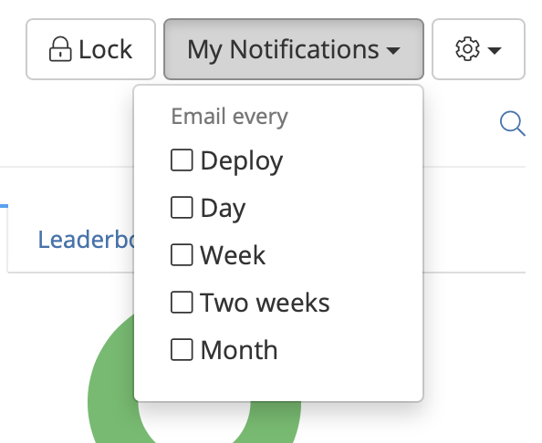
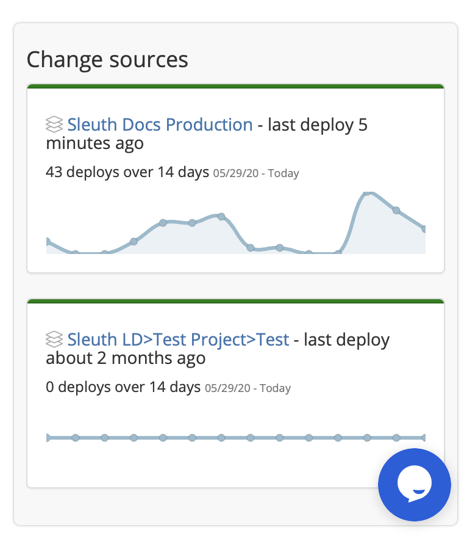

# Notifications

In addition to the available [Chat Ops](integrations-1/chat-ops/) integrations, Sleuth can notify you and your team when something happens with your source of change, including targeted messages for your entire team or just yourself. 

### Setting up Slack notifications

Before you set up project-level Slack notifications, the [Slack integration](integrations-1/chat-ops/slack.md#about-the-integration) must first be made the Sleuth organization level. Once that's done, you can configure how those notifications are sent and who receives them. 

#### Setting up project-level Slack notifications

1. Select a project in the sidebar, then click **Project Settings**. 
2. Click **Slack Notifications**. 
3. In the _Slack channel_ dropdown, start typing the name of the Slack channel that will receive change notifications. If the channel is private, you will need to invite the _Sleuth bot_ to the channel first.   
4. Click **Save**. 

At this point you can notify users in your Slack organization that a notifications channel for this project has been set up and that they should join it to receive any and all change notifications that occur in that project. 

#### Setting up personal Slack notifications

In the previous section you created project-level Slack notifications. Team members will only receive change notifications if they join the corresponding Slack channel. However, you might want customized notifications sent directly to yourself. You can do this by configuring your user-level Slack notifications preferences: 

1. Select your username in the bottom of the sidebar, then click **Manage Account**. 
2. Click **Notifications**. 
3. Any [email notifications](notifications.md#setting-up-email-notifications) you've already setup will be displayed here. Enable the **Slack notifications** toggle. 
4. You can enable or disable **Deployed code** and/or **Impact of your Code**:
   * **Deployed code**: Selecting **All** means you will receive a Slack notification every time code in which you are the author is deployed.  Selecting **Exclude my deployments** notifies you of all deployments except those in which you're the author. This option is great if you're up to speed on your own code but want to keep tabs on how the rest of your team's deployments are doing. 
   * **Impact of your Code**: Selecting **All** means you will always receive a Slack notification about the impact of your code on the rate of production errors.  Selecting **Exclude healthy** sends a notification only if a deployment occurs in which the impact of your code on productions errors is anything except _Healthy;_ this includes _Unhealthy_, _Ailing_, or _Improved_.    

### Setting up email notifications 

Email notifications are sent at the frequency you select, and can be configured individually at the project and change source level. 

#### To set up at the project level

1. Select a project in the sidebar. 
2. Click **My Notifications** in the upper-right corner of the Dashboard.    
3. Select a notification frequency in the dropdown. More than one can be selected.  

#### To set up at the change source level

1. Select a project in the sidebar. The project dashboard is displayed. 
2. Select a change source in the _Change sources_ section and click on its title link. The dashboard for the change source is displayed.    
3. Click **My Notifications** in the upper-right corner of the Dashboard.    
4. Select a notification frequency in the dropdown. More than one can be selected. 

### Notes

Qs: 

1. Set up Slack for org
2. Set up Slack for project
3. Set up Slack for 1:1 notifications
4. Do Slack and email notifications mirror same action/activity? **No**
5. Are **My Notifications** unique to each project/change source screen? **YES**
6. Explain how it works in, eg, Company X, where 13 users will be part of team, yet Company X Slack account is probably handled by a central admin. Is the ENTIRE company the Org, and individual teams will create their own PROJECTS? How does Sleuth arbritrate members who join org with @companyx.com email address, but need to join only certain projects? Company X is the ORG; within the COX ORG there are 
7. We need to know who you are in Slack **AND** GitHub \(Bitbucket \(Bitbucket Server for local\) or LaunchDarkly\); hosted GitLab is easier Contact Support if you need more info 

"Slack app connected. Next step: choose the Slack channel to which we can send notifications about deploys as they happen." 

