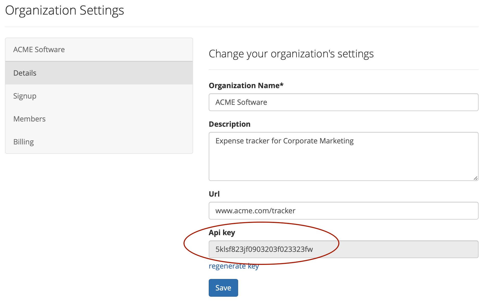
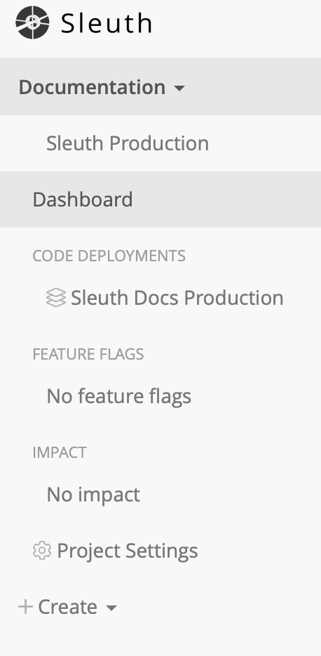
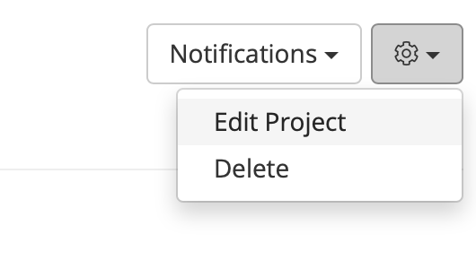
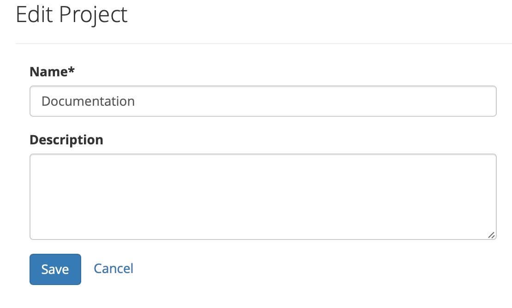

# Projects

## Creating a project

To configure a project you must link your personal or the organization's GitHub or Bitbucket accounts to your Sleuth organization.

To create a new project:

1. Click **Create**. 
2. Click **Create project**.
3. **Name** your project and give it a **description**, if desired. 

To track deployments, **Sleuth must have access** to the code you deploy. In order to access all of your commist, issues and pull request information, Sleuth needs to authorize with a **full read and write** scope of your code repository and most other change sources. 

**Select the code repository** from the dropdown and specify the branch that you deploy from. Sleuth will initialize the project with your last commit until further deploys are detected. 

### Change sources <a id="telling-us-when-you-deploy"></a>

Sleuth uses your code repos as its main sources of change. By analyzing past behavior \(i.e., commits, pull requests, issues, feature flags, etc.\) and comparing it with your current and future deploys, Sleuth paints a picture of your entire project's health status, giving you instant feedback on the changes you and your team are making to the code base. Sleuth can also look at feature flags and infrastructure environments, and provide you with actionable metrics for those platforms. 

#### Adding a change source

To add a source of change, first make sure you have the necessary permissions. 


See [Change Sources](integrations-1/change-sources/) to see which sources of change Sleuth supports. 


### Notifying Sleuth when you deploy <a id="telling-us-when-you-deploy"></a>

How does Sleuth know when you have deployed? There are three different ways that Sleuth can be notified: 

* [Manually](projects.md#manually-registering-your-deploy)
* [Automatically tracking by push](projects.md#automatic-tracking-for-each-push-to-the-configured-branch)
* [Automatically tracking by tag](projects.md#automatic-tracking-for-each-tag-made-against-the-configured-branch)

#### Manually registering your deploy

Ping Sleuth with a Git commit SHA or tag to mark your deploy by making a POST request, like so:

```text
curl -X POST -d api_key=YOUR_API_KEY -d sha=YOUR_SHA https://sleuth.io/api/1/ORG_NAME/PROJECT_NAME/register_deploy
```

Make sure to replace `YOUR_API_KEY`, `YOUR_SHA`, `ORG_NAME` and `PROJECT_NAME` with your actual information. You can find your API Key in **Organization Settings** &gt; **Details** &gt; **Api key**. 



\*\*\*\*

**You can find `YOUR_SHA` with the commands:**

```text
git checkout YOUR_BRANCH
git rev-parse HEAD
```

#### Automatic tracking for each push to the configured branch

When this option is selected Sleuth will add a POST-commit hook to your repository.

This will ping Sleuth every time a commit is made. When we detect a commit against your projects branch we'll register a new deploy.

#### Automatic tracking for each tag made against the configured branch

When this option is selected, Sleuth will add a POST-commit hook to your repository.

This will ping Sleuth every time a commit is made. When we detect a tag against your projects branch, Sleuth will register a new deploy.

### Tagging your code <a id="how-to-tag-your-code"></a>

A tag name can be anything but we suggest something like: `production_2015-04-18--16-15`

To tag your code and push your changes to your remote repository, use a similar command to:

```text
git tag production_2015-04-18--16-15
git push git@github.com:joeuser/myrepo.git production_2015-04-18--16-15
```

## Editing a Project

After creating a project, you might want to make changes to its configuration. This can be pointing to a different repo or adding or deleting an integration. This can be done by selecting your project in the sidebar.

In the screenshot below, **Documentation** is the currently the active project. 



With the project selected, click on the gear icon and select **Edit Project**. 





Here, on the **Edit Project** dialog, you can change the **project name** or add a **description**.

