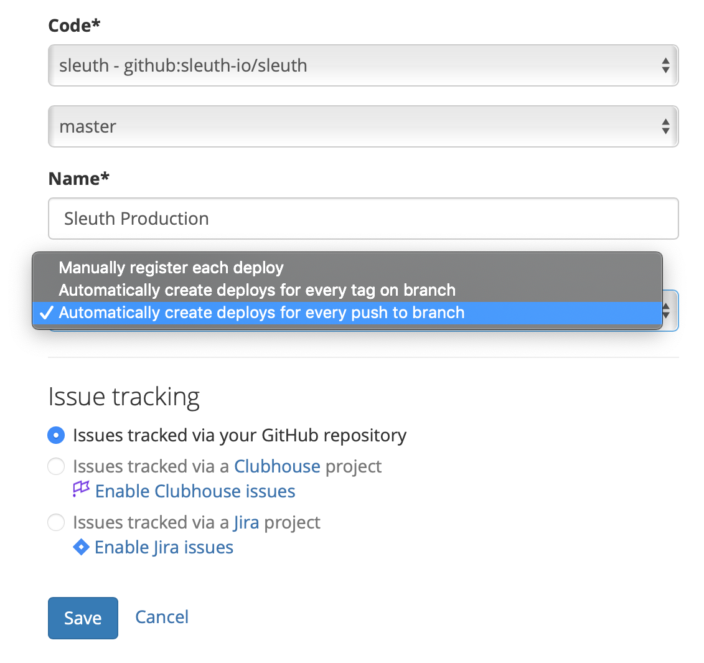

# Projects

## Creating a Project

To configure a project you must link your personal or organization's GitHub or Bitbucket accounts to your Sleuth organization.

To create a new project:

1. Click **Create**. 
2. Click **Create project**.


To track deploys we must have access to the code you deploy. In order to access all of your commit, issue and pull request information, we need to authorize with a **full read and write** scope of your Github or Bitbucket repo.

Select the code repository from the dropdown and specify the branch that you deploy from. Sleuth will initialize the project with your last commit until further deploys are detected. 



### Notifying Sleuth when you deploy <a id="telling-us-when-you-deploy"></a>

How does Sleuth know when you have deployed? There are three different ways that Sleuth can be notified: 

1. [Manually](projects.md#manually-registering-your-deploy).
2. [Automatically tracking by push](projects.md#automatic-tracking-for-each-push-to-the-configured-branch).
3. [Automatically tracking by tag](projects.md#automatic-tracking-for-each-tag-made-against-the-configured-branch). 

#### Manually registering your deploy

Ping us with a Git commit sha or tag to mark your deploy by making a POST to Sleuth.

```text
curl -X POST -d api_key=YOUR_API_KEY -d sha=YOUR_SHA https://sleuth.io/api/1/ORG_NAME/PROJECT_NAME/register_deploy
```

Make sure to replace `YOUR_API_KEY`, `YOUR_SHA`, `ORG_NAME` and `PROJECT_NAME` with your actual information.

**You can find `YOUR_SHA` with the commands:**

```text
git checkout YOUR_BRANCH
git rev-parse HEAD
```

#### Automatic tracking for each push to the configured branch

When this option is selected Sleuth will add a POST-commit hook to your repository on GitHub or Bitbucket.

This will ping Sleuth every time a commit is made. When we detect a commit against your projects branch we'll register a new deploy.

#### Automatic tracking for each tag made against the configured branch

When this option is selected, Sleuth will add a POST-commit hook to your repository on Bitbucket or GitHub.

This will ping Sleuth every time a commit is made. When we detect a tag against your projects branch, Sleuth will register a new deploy.

### Tagging your code <a id="how-to-tag-your-code"></a>

A tag name can be anything but we suggest something like: `production_2015-04-18--16-15`

To tag your code and push your changes to your remote repository, use a similar command to:

```text
git tag production_2015-04-18--16-15
git push git@github.com:joeuser/myrepo.git production_2015-04-18--16-15
```

## Editing a Project

After creating a project, you might want to make changes to its configuration. This can be pointing to a different repo or adding or deleting an integration. This can be done by selecting your project in the sidebar.

In the screenshot below, **Documentation** is the currently the active project. 


With the project selected, click on the gear icon and select **Edit Project**. 


Here you can change the project name or add a description.

