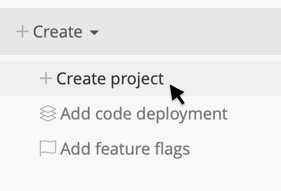

# Creating a project

To configure a project, you must link your personal or organization's [Bitbucket](https://bitbucket.org/) or [GitHub](https://github.com/) accounts to your organization.

To create a project, click the '+' button and choose 'Create project'. You will be able to link your Bitbucket or GitHub account from this screen if you haven't already done so.

To track deploys, Sleuth must have access to the code you deploy. In order to access all of your commit, issue and pull request information, Sleuth needs to authorize with a **full read and write** scope.

To create a new project, select the code repository from the dropdown and specify the branch that you deploy from. Sleuth will initialize the project with your last commit until further deploys are detected.

