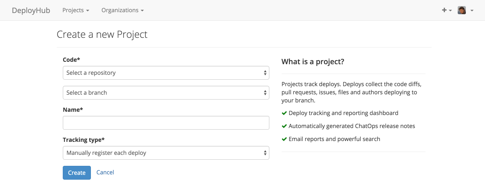

# Creating a project

To configure a project, you must link your personal or organization's [Bitbucket](https://bitbucket.org/) or [GitHub](https://github.com/) accounts to your organization.

To create a project, click the '+' button and choose 'create project'. You will be able to link your Bitbucket or GitHub account from this screen if you haven't already done so.



To track deploys we must have access to the code you deploy. In order to access all of your commit, issue and pull request information we need to authorize with a **full read and write** scope.

To create a new project just select the code repository from the dropdown and specify the branch that you deploy from. [Sleuth](https://sleuth.io/) will initialize the project with your last commit until we start detecting further deploys.

```
$ give me super-powers
```


 Super-powers are granted randomly so please submit an issue if you're not happy with yours.


Once you're strong enough, save the world:


```bash
# Ain't no code for that yet, sorry
echo 'You got to trust me on this, I saved the world'
```



