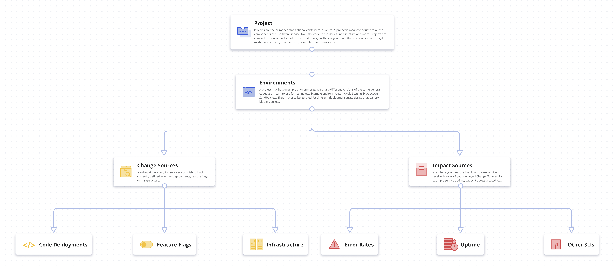
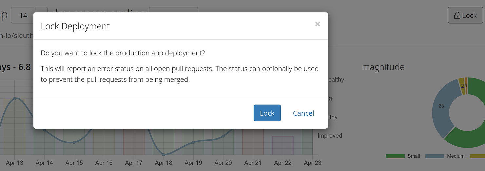

# Terminology

## Information Architecture \(IA\)

Sleuth can help you track the health and status of your deploys by providing a single of pane of glass through which you can view all of your change and impact sources. The Sleuth information architecture terms should already be familiar to you, since we use industry-standard CI/CD nomenclature. 

In Sleuth you create a **Project** container, which houses all the necessary **environments** your team might need to create, develop and test your applications. These environments might include production, staging, or development, and could even account for different deployment strategies such as canary, blue/green, rolling deployments, etc. 

Once you've created and configured the various environments within your project, you can start adding connections to your **Change Sources** and **Impact Sources** \(see [Integrations](../integrations-1/about-integrations.md) for more information on connecting Change Sources and Impact Sources\). 

Sleuth tracks Change Sources, such as **Code Deployments**, **Feature Flags**, and **Infrastructure**, and constantly analyzes the information they contain to capture the state of your code before, during, and after deploys. Additionally, Sleuth intakes information provided by various Impact Sources, such as **Error Rates**, **Uptime**, and **Other SLIs**. 

## Dashboard

Combining Impact Source information with Change Source data is what drives the information you see on the Sleuth [Dashboard](../dashboard.md). 

You can instantly see the impact of your deploys on your entire project environment over a period of time by viewing the Trend Graph; for detailed information on individual deploys you can view a deploy card \(see below\). 


You can view a live version of the Sleuth Dashboard at [https://app.sleuth.io/sleuth/sleuth](https://app.sleuth.io/sleuth/sleuth).   
It's what the Sleuth team uses everyday to make **awesome**! ✨ 


## Deploy cards

By viewing a deploy card, you can: 

* see who authored the deploy and how many PRs/commits/issues/files were in the deploy; 
* instantly view the pull request in whichever repository it resides in \([GitHub](../integrations-1/change-sources/code-deployment/github.md) or [Bitbucket](../integrations-1/change-sources/code-deployment/bitbucket.md), for example\);
* know when the deploy occurred; 
* get an objective, historical assessment of your project's health __\(_Unhealthy_, _Ailing_, _Healthy_, _Improved_\); 
* see which environment and project the deploy occurred in; 
* see all Slack reaction emojis to the deploy event; 
* know how large or small of an impact the deploy had on your project overall. 

To get more information about a deploy, you can:

* Click on the card title to view detailed information on the timeline, pull requests, commits, issues, files, builds, and authors; or
* Click on any of the impact, pull requests or commit SHAs or links, which takes you to the correspoding tool's website, such as Sentry, Rollbar, GitHub, etc. 
* Click on the related code link to view the deploy information for a change caused by a feature flag change source. 

## Size

Another significant metric assessment Sleuth provides is **Size**. The Size chart shows you how many large versus small deploys you have committed to your repos \(changes can be _Small_, _Medium_, _Large_, or _Gigantic_\). Since the overall goal of solid CI/CD practice is to deploy small and deploy often, the Size chart gives you instant insight into whether you're _continuously deploying_ small, effective changes to your repositories instead of occasional _gigantic_, unstable changes, which could prove problematic if a rollback is necessary when a change proves fatal to your application. 

**Projects** are the main entities in Sleuth. They house your code deployments, feature flags, impact sources, and any manual changes you configure. Think of them as the application you're deploying.  

## Code deployment

**Code deployments** track changes made via source code and the software development surrounding the change. Each deploy collects the **code reviews, issues, code changes and authors** of the change being deployed to your systems. Code can live on either [GitHub](../integrations-1/change-sources/code-deployment/github.md) or [Bitbucket](../integrations-1/change-sources/code-deployment/bitbucket.md) repos. 

## Feature flags

Sleuth tracks **feature flags** changes in [LaunchDarkly](../integrations-1/change-sources/feature-flags/launchdarkly.md) by changing the values of feature flags. Each flag change collects the changes made, who made them, and the state of your other flags and the linked code version deployed at the time of the change. Feature flags are an integral part of software development, and Sleuth tracks them along with other metrics to provide you with a snapshot of your deployments' health. 

## Impact

The effect of your deploys over a predetermined period of time. As you perform your commits and PRs to your code repos, Sleuth is constantly ingesting the information generated by your change sources and impact sources. The collective effect of the errors generated by all of your change sources and impact sources is what defines the **impact** \([observability](https://en.wikipedia.org/wiki/Observability) and [SLI](https://en.wikipedia.org/wiki/Service_level_indicator) are similar terms used in software development\). Sleuth detects when the impact value has deviated from “normal” and keeps you posted on this deviation by constantly generating an impact metric. 

A user might want to know if a deploy has had a positive/negative/neutral impact on their project, or wants to know how impact is trending in relation to the deploys that are occurring. They want to understand if a deploy has changed the “normal” behavior of their system so they can react appropriately.

Once a commit is performed, Sleuth samples the commit at the moment of deploy, started by defining a standard deviation, and then afterwards for up to 60 minutes. The average of the errors in that time period is used to compute the impact, which is visible on the deploy card for every commit. This feature is exclusive to Sleuth, and provides you with higher-resolution feedback other than a simple👍or 👎. 

Impact is integral to the Sleuth experience, and is one of the main metrics Sleuth computes to provide you with the overall health status of your deploys. 

## Deploy Tracking Type

When adding a code deployment change source, you can specify when and how Sleuth should track changes in your repo. 

* **Manually register each deploy**: You must manually notify Sleuth when a commit has been made to your code repo. This can be done via the [Sleuth API](sleuth-api.md#manual-deploy-registration). 
* **Automatically create deploys for every tag on branch**: When a commit is tagged, Sleuth will automatically create a deploy. 
* **Automatically create deploys for every push to branch**: When a commit is pushed, Sleuth will automatically create a deploy. 

## Deployment Locking

 The Lock feature in Sleuth prevents pull requests from merging into main branches, and generates automatic notifications via your Chat Ops [integrations](../integrations-1/about-integrations.md) \(e.g., [Slack](../integrations-1/chat-ops/slack.md)\). 

Read Sleuth CTO [Don Brown's blog post](https://www.sleuth.io/post/prevent-unwanted-changes-with-sleuth-deployment-locking) on how Sleuth's locking feature can make your DevOps life easier! 

## Leaderboard

The Leaderboard provides a competitive component to Sleuth by endeavoring developers to deploy faster and smaller. 

**Scoring**

The score of an author is the sum of several categories of scoring:

* **Deploy**: 5 points for each deploy.
* **Author**: 3 points for each deploy in which the author was involved but didn't perform the deploy.
* **Impact**: 2 points for each deploy rated _Healthy_, 10 for each deploy rated _Improved_.
* **Reaction**: ½ point for each reaction to the author's deploys, rounded up. 

## View Compare

The View Compare function provides a link to the right of the SHA that opens up the corresponding code repo \(i.e., Bitbucket or GitHub\), where you can view the changes between different branches. 

Since the interfaces vary, consult the documentation for the corresponding code hosting service for help on using the compare function. 

