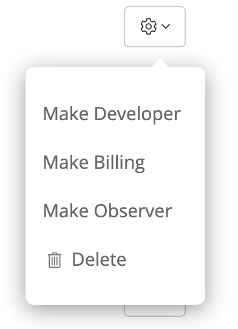

# Role Based Access Control

With RBAC (role-based access control), you can control access rights to users based on their roles. These controls enable the **Owner** to control what members of a Sleuth organization can do and what portions of the control panel they can see and alter. For example, only the Owner or Administrator can access billing information or change the name of or delete a project. 

These are the four different roles a Sleuth user can assume:

| Role              | Privileges                                                                                                                                     |
| ----------------- | ---------------------------------------------------------------------------------------------------------------------------------------------- |
| **Owner**         | The organization owner that cannot be removed. An organization will always have one, and only one, owner. **This account cannot be deleted. ** |
| **Administrator** | Can do anything. Can do the same thing as an Owner. Multiple Administrators can be created, and Administrators can be removed.                 |
| **Developer**     | Can add integrations, deployments, but not add, remove, or manage any users.                                                                   |
| **Observer**      | Can only view deployment information. Observers cannot change anything.                                                                        |
| **Billing**       | Can manage an organizations billing and will receive invoice emails.** You are not billed for Billing users.**                                 |

Login to your Sleuth account (but only if you're an Owner or Administrator), then go to _**Organization Settings > Members**_, then select the cog dropdown next to the user to change their role:

  

You can invite new members and assigned roles by entering their e-mail address in the _Member_ field, selecting a role, then pressing **Invite**. The invitation will be displayed in the member list. When they accept the invitation, their Gravatar, role, name, and email address will be displayed. 

