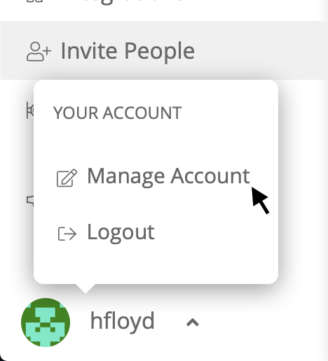

# Account

The following settings can be configured for your personal Sleuth account: 

| Setting | Description |
| :--- | :--- |
| \*\*\*\*[**Account**](account.md)\*\*\*\* | Change basic account setting information |
| \*\*\*\*[**Notifications**](notifications.md)\*\*\*\* | Manage your user-level Slack and email notifications |
| \*\*\*\*[**Identities**](identities.md)\*\*\*\* | Manage user- and organization-level integration configurations, as well as user-level tokens |

To manage your Account settings, click on your username in the bottom of the sidebar, then select **Manage Account**.

  

