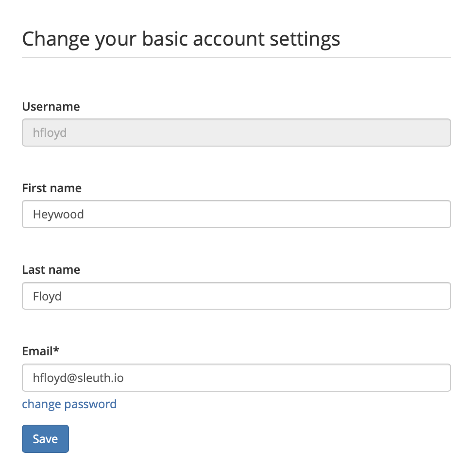
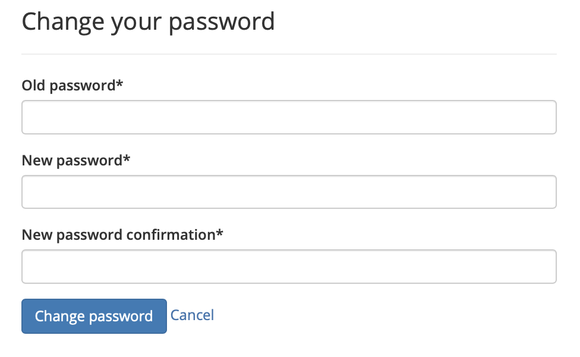

# Account settings

The **Account** tab contains information for your personal Sleuth account in your organization. Here you can change your **First** **Name** and **Last** **Name**. However, you cannot change your **Username**, which is automatically generated when your account is created. 

If you need to change your password for any reason, click on the Change Password link and fill out the new information. You will need your current password to create and save the new password. 

