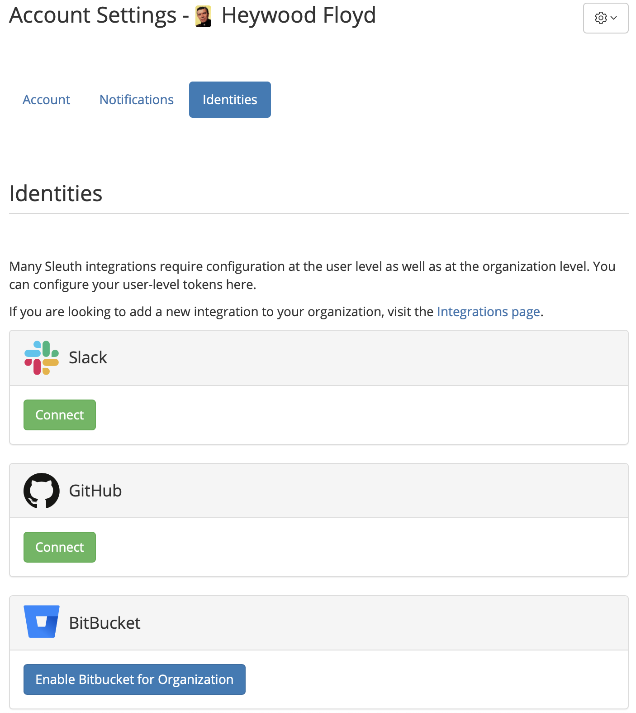
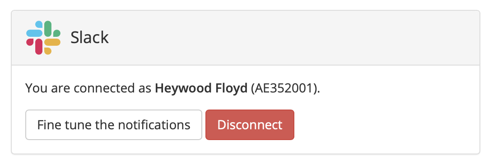

# Identities settings

The **Identities** tab is where user-level modifications to integrations are made, if required by the integration for proper functionality.

### Slack

Although the Sleuth DORA App for Slack is configured at the organization level, you are able to manage your own personal Slack notifications.

If your organization has enabled the Sleuth DORA App for Slack, you can setup your personal Slack account so that you can control which notifications are received relative to your organization's communication settings. For example, you might not want every notification sent out by your organization.

#### Configuring Slack notifications

To configure your Slack notifications:

1. Press the _Fine tune the notifications_ button in the Slack identities panel. 

### GitHub

### Bitbucket

### LaunchDarkly
