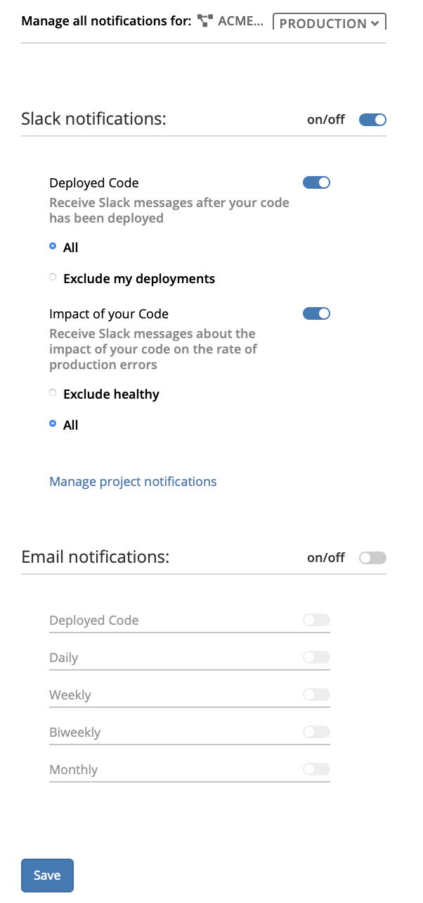
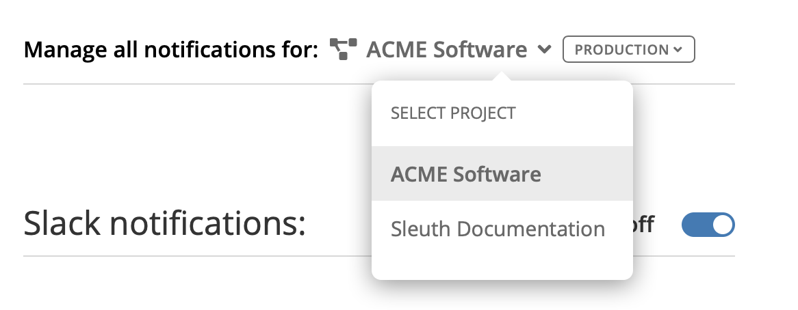
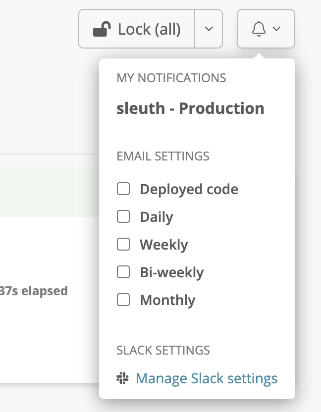

# Notifications settings

The **Notifications** tab is where you can make changes to the notifications Sleuth generates. There are two types of notifications that Sleuth sends to keep you up to date on your organization's deployment activity: 

* [**Slack Notifications**](notifications.md#slack-notifications)****
* ****[**Email Notifications**](notifications.md#email-notifications)****


You must [enable the Slack integration](../../modeling-your-deployments/projects/notifications.md#setting-up-slack-notifications) at the organization level before you can make modifications to Slack Notifications. 


### **Project/Environment Pairing**

Before making any changes to your Slack and email notifications, make sure you select the project and environment pairing first. Every project and environment pairing has its own notifications preferences; when you change the project and/or environment in the selector dropdown, you will see the preference toggles dynamically update to reflect the settings in the project/environment pairing. 

Before changing your notifications settings, select the Project and Environment you wish to change notifications in: 

1. Select the **Project** dropdown and select a project. 
2. Select the **Environment** dropdown and select an environment. Only environments contained in the selected project are displayed.

The Slack and email notifications preferences automatically update to reflect the current notification settings. Any changes made are saved within the project/environment pairing. 

### **Slack Notifications**

Here you can manage the frequency of Slack notifications, as well as the triggers that generate or suppress a Slack notification. 


You can also access Slack notification settings from the _My notifications_ dropdown in the Dashboard. Click **the bell icon** then select **Manage Slack settings**. 



To receive messages from the Sleuth bot, recipients must have linked their source account (i.e., GitHub, Bitbucket, etc.) and their Slack account to their Sleuth account. 


To enable personal Slack notifications: 

* Press the **on/off** toggle to **on**. The **Deployed Code** and **Impact of your Code **toggles are automatically turned on by default, along with the **All** setting for both.  
* **Deployed Code: **With this set to **on **and the **All** radio button selected, you will receive a personal Slack notification whenever code in the selected project/environment is deployed. If you don't want to receive a notification on deployments in which you're the author, select the **Exclude my deployments** radio button. 
* **Impact of your Code:** With this set to **on** and the **Exclude healthy** radio button selected, you will receive a personal Slack notification whenever code in the selected project/environment is deployed and whose health status is **Unhealthy**, **Ailing**, or **Improved**, based on the rate of production errors. Select **All** to receive a personal Slack notification, regardless of its health status/impact.  

Click _**Manage project notifications**_ to manage the Slack notifications generated by the selected project. This will take you to the [Slack Notifications tab](../project/slack-notifications.md) of Project settings. 


[Read more](../../integrations-1/slack.md#about-the-integration) about setting up the Slack integration for the organization. 


### **Email Notifications**

If you've already setup projects and change sources, you can configure email notifications for them directly from the Dashboard. Read [Notifications](../../modeling-your-deployments/projects/notifications.md#setting-up-email-notifications) for more information. 

The changes made here in the Notifications tab reflect any changes made in the Dashboard for every project and organization pairing. You can view the notifications you're adjusting in the _**Manage all notifications for:**_ selector at the top of the **Notifications** tab. 

The Email Notifications preferences set here are also reflected in the Dashboard for the selected project/environment pairing (see below). This applies to all notifications preferences made in the same organization. 

