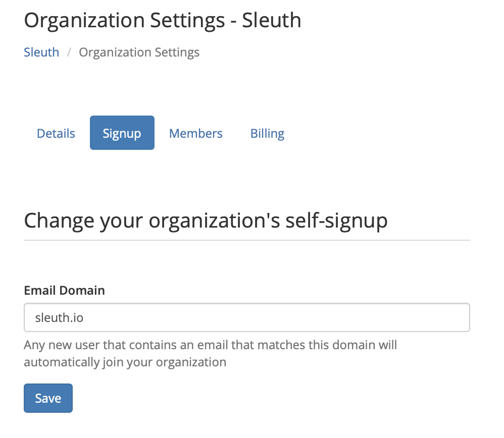

# Organization Settings

Owners and Administrators \(see [Access Control](../user-administration.md) for more information about roles in Sleuth\) in Sleuth are able to make changes to the organization that affects all users and projects that belong to that organization. Some integrations allow project- and user-level settings to be made, such as the [Slack integration](../integrations-1/chat-ops/slack.md). For example, a project could generate a Slack message when a deploy occurs, but a user might only want to receive a Slack message if the deploy is **not** healthy. 

## Details

## Signup

## Members

Give members different roles to control what parts of Sleuth they can see and change

* **Owner** - The organization owner that cannot be removed.
* **Administrator** - Can do anything.
* **Developer** - Can add integrations, deployments, but not users.
* **Observer** - Can view deployment information but can't change anything.

## Billing

