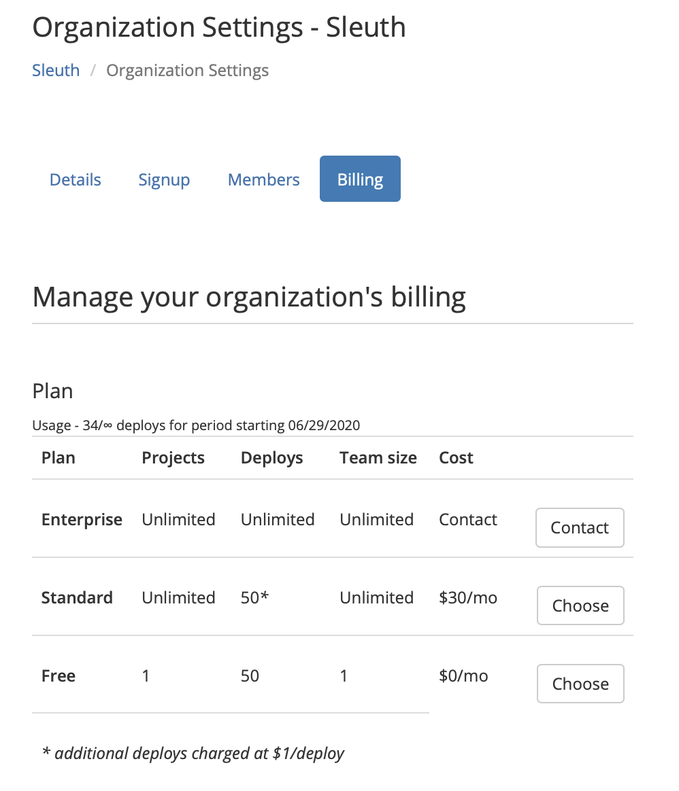

# Billing

The **Billing** tab allows the organization owner to manage billing information for their organization. 

An Owner or Administrator can change the pricing plan by selecting a new plan and pressing **Choose**. For Enterprise plans, you will need to [contact us](mailto:support@sleuth.io). 

Current plan usage is also displayed under **Plan**. In the example below, 34 deploys have been made out of an unlimited amount \(∞\), starting from June 29, 2020. 


For the latest Sleuth plan pricing information, visit the [Sleuth Pricing page](https://www.sleuth.io/pricing). 


