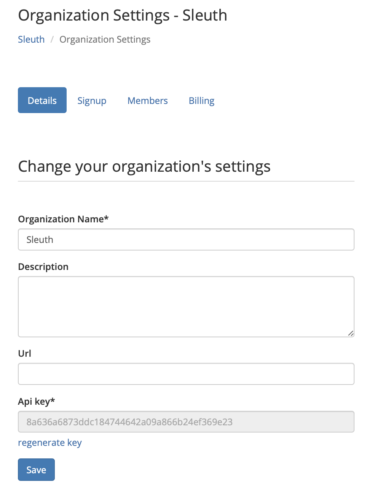

# Details


Only **Owners** and **Administrators** have access to the _Organization Settings_ and _Invite People_ selections in the Organization dropdown. Developers and Observers must request access from an Owner or Administrator. Read [Access Control](../access-control.md) for more information about RBAC \(role-based access control\) in Sleuth. 


The **Details** tab contains general information about the selected **organization**. The name of selected organization is displayed at the top of the sidebar. Select the dropdown to select a different organization, if you belong to more than one. 

* You can change the name of your organization in the **Details** tab, along with an optional **Description** for the organization. 
* Enter an optional well-formed URL in the **URL** field. 
* The **API Key** field contains an API key for external application access to your organization's data. Keep this key private, and **do not share it** with anyone or any system without knowing what you're doing! If you feel your API key has been compromised, click Regenerate Key to obtain a new. Any external applications that access your Sleuth organization programmatically might stop working, so be sure you know what you're doing! 
* Press **Save** after making any changes in the _Details_ tab. 

